# 10235501451 唐屹 第二次项目实验报告

## lab1

### lab1P0

P0 阶段要求补全 `kv/storage/standalone_storage/standalone_storage.go` 文件中标记为 `// YOUR CODE HERE (lab1)` 的两个核心方法：

1. **`Reader` 方法** ：创建并返回一个只读的存储读取器，支持从 badger 中读取数据；
2. **`Write` 方法** ：接收批量的写操作（包含 Put/Delete 类型），将这些操作原子性地写入 badger 数据库。

在开始写代码之前，我们要明确代码的编写不能脱离于框架的代码规范，因此我们要找到定义规则的相关联文件，我从下列内容中找寻到如何解决问题的方法:

`Write` 方法中的注释 `Try to check the definition of storage.Modify and txn interface of badger`,`StandAloneStorage` 结构体的注释表明它实现了 `storage.Storage` 接口，因此需要找到该接口的定义文件，同时代码中引入了 `github.com/pingcap-incubator/tinykv/kv/util/engine_util` 等的包，因此需要查看相关的文件。

基于上述思路，我重点查看了以下三个核心关联文件，这些文件构成了 P0 阶段的代码规范约束：

1. `kv/storage/storage.go`：定义了 `Storage` 和 `StorageReader` 接口

```go
// Storage 接口：规定了存储引擎的核心功能
type Storage interface {
	Start(client scheduler_client.Client) error
	Stop() error
	Write(ctx *kvrpcpb.Context, batch []Modify) error // 批量写入方法
	Reader(ctx *kvrpcpb.Context) (StorageReader, error) // 读取器创建方法
	Client() scheduler_client.Client
}

// StorageReader 接口：规定了读取器的核心功能
type StorageReader interface {
	// 关键约束：key不存在时返回nil，而非报错
	GetCF(cf string, key []byte) ([]byte, error)
	IterCF(cf string) engine_util.DBIterator
	Close()
}

```

2. `kv/storage/modify.go`：定义封装了所有写操作的核心数据结构（`Modify`/`Put`/`Delete`）

   ```go
   // Modify：封装单个写操作（Put/Delete）
   type Modify struct {
   	Data interface{}
   }

   // Put：写入操作（包含列族、key、value）
   type Put struct {
   	Key   []byte
   	Value []byte
   	Cf    string
   }

   // Delete：删除操作（包含列族、key）
   type Delete struct {
   	Key []byte
   	Cf  string
   }

   // 便捷方法：避免重复的类型断言，具体实现逻辑省去
   func (m *Modify) Key() []byte { /* 实现逻辑 */ }
   func (m *Modify) Value() []byte { /* 实现逻辑 */ }
   func (m *Modify) Cf() string { /* 实现逻辑 */ }
   ```

3. `kv/util/engine_util/util.go`：封装了 badger 列族模拟的工具函数（如 `KeyWithCF`），是实现列族功能的核心依赖。

```go
// 核心函数：将列族名与key拼接，生成编码后的key（模拟列族）
func KeyWithCF(cf string, key []byte) []byte {
	return append([]byte(cf+"_"), key...)
}

// 辅助函数：从事务中读取指定列族的key（BadgerReader已使用）
func GetCFFromTxn(txn *badger.Txn, cf string, key []byte) (val []byte, err error) { /* 实现逻辑 */ }
```

`Reader` 方法实现

根据 `storage.go` 的接口要求，`Reader` 方法需要返回一个只读的 `StorageReader`，而 badger 的所有读操作必须在事务中进行，因此核心思路是：

1. 开启 badger 的只读事务（`NewTransaction(false)`）；
2. 利用已有代码的 `NewBadgerReader` 函数创建读取器实例；
3. 返回读取器和空错误。

```go
func (s *StandAloneStorage) Reader(ctx *kvrpcpb.Context) (storage.StorageReader, error) {
	// 1. 开启badger的只读事务（false表示只读）
	txn := s.db.NewTransaction(false)
	// 2. 创建BadgerReader实例
	reader := NewBadgerReader(txn)
	// 3. 返回读取器和空错误
	return reader, nil
}
```

`Write` 方法实现

根据 `storage.go` 的原子性要求、`modify.go` 的数据结构、`engine_util` 的列族规则，核心思路是：

1. 开启 badger 的读写事务（`NewTransaction(true)`），保证批量操作的原子性；
2. 延迟调用 `txn.Discard()`，避免事务资源泄漏（提交失败时自动回滚）；
3. 遍历批量操作，利用 `Modify` 的便捷方法获取列族和 key，通过 `KeyWithCF` 编码 key；
4. 区分 Put/Delete 类型，调用 `txn.Set`/`txn.Delete` 执行操作；
5. 提交事务，将修改持久化到磁盘。

```
func (s *StandAloneStorage) Write(ctx *kvrpcpb.Context, batch []storage.Modify) error {
	// 1. 开启badger的读写事务（true表示读写，保证批量修改的原子性）
	txn := s.db.NewTransaction(true)
	// 延迟关闭事务：如果提交失败，自动回滚并释放资源
	defer txn.Discard()

	// 2. 遍历所有Modify操作，逐个处理
	for _, m := range batch {
		// 获取列族名和key（利用Modify的便捷方法，避免重复的类型断言）
		cf := m.Cf()
		key := m.Key()
		// 用KeyWithCF编码key（遵循列族模拟规则）
		encodedKey := engine_util.KeyWithCF(cf, key)

		switch data := m.Data.(type) {
		// 3. 处理Put操作：写入键值对
		case storage.Put:
			value := data.Value
			// 调用txn.Set写入编码后的key和value
			if err := txn.Set(encodedKey, value); err != nil {
				return err
			}
		// 4. 处理Delete操作：删除键值对
		case storage.Delete:
			// 调用txn.Delete删除编码后的key
			if err := txn.Delete(encodedKey); err != nil {
				return err
			}
		}
	}

	// 5. 提交事务：将所有修改批量写入磁盘
	if err := txn.Commit(); err != nil {
		return err
	}

	// 6. 所有操作成功，返回nil
	return nil
}
```

测试截图


### lab1P1a


首先 `make labP1a`，根据输出了解需要完成的代码，从报错日志能明确看到，panic 发生在：

```bash
github.com/pingcap-incubator/tinykv/kv/raftstore.(*peer).HandleRaftReady(...)
/Users/tangyi/Desktop/study/db/project2/vldb-2021-labs-master/tinykv/kv/raftstore/peer.go:370 +0x130
```

这说明：`kv/raftstore/peer.go`文件中的 `HandleRaftReady`方法还是空的,继续执行测试后，又出现了多个同类 panic 错误，分别指向：`kv/raftstore/peer_storage.go`中的 `Append`方法：日志追加逻辑未实现；`kv/raftstore/peer_storage.go`中的 `SaveReadyState`方法：Raft 状态持久化逻辑未实现；`kv/raftstore/peer_msg_handler.go`中的 `proposeRaftCommand`方法：客户端请求提议逻辑未实现。这些 panic 错误明确了本次实验需要完成的四个核心方法，我将按照顺序 `Append` → `SaveReadyState` → `proposeRaftCommand` → `HandleRaftReady`逐步实现。

`Append`实现

`Append`方法是 Raft 日志持久化的基础，其核心作用是将 Raft 日志条目写入 Raft 引擎的批量写入器（`engine_util.WriteBatch`），并清理与新日志冲突的旧日志。

```go
func (ps *PeerStorage) Append(entries []eraftpb.Entry, raftWB *engine_util.WriteBatch) error {
	log.Debug(fmt.Sprintf("%s append %d entries", ps.Tag, len(entries)))
	prevLastIndex := ps.raftState.LastIndex
	if len(entries) == 0 {
		return nil
	}
	lastEntry := entries[len(entries)-1]
	lastIndex := lastEntry.Index
	lastTerm := lastEntry.Term
	panic("not implemented yet")
	// YOUR CODE HERE (lab1).
	for _, entry := range entries {
		// Hint1: in the raft write batch, the log key could be generated by `meta.RaftLogKey`.
		//       Also the `LastIndex` and `LastTerm` raft states should be updated after the `Append`.
		//       Use the input `raftWB` to save the append results, do check if the input `entries` are empty.
		//       Note the raft logs are stored as the `meta` type key-value pairs, so the `RaftLogKey` and `SetMeta`
		//       functions could be useful.
		log.Debug(fmt.Sprintf("entry=%v", entry))
	}

	for i := lastIndex + 1; i <= prevLastIndex; i++ {
		// Hint2: As the to be append logs may conflict with the old ones, try to delete the left
		//       old ones whose entry indexes are greater than the last to be append entry.
		//       Delete these previously appended log entries which will never be committed.
	}

	ps.raftState.LastIndex = lastIndex
	ps.raftState.LastTerm = lastTerm
	return nil
}
```

代码中的两个 Hint 明确了实现逻辑的关键步骤，需要逐一实现：

Hint1 （日志写入）：

1. 日志 Key 需通过 `meta.RaftLogKey(regionId, entry.Index)`生成（保证不同 region、不同索引的日志唯一性）；
2. Raft 日志以 `meta`类型的键值对存储，需使用 `SetMeta`函数将日志条目写入 `raftWB`；
3. 需先检查 `entries`是否为空（原代码已实现该检查）；
4. 日志追加后需更新 `raftState`的 `LastIndex`和 `LastTerm`（原代码已保留该逻辑）。

Hint2 （旧日志删除）：

1. 新日志可能与旧日志冲突，需删除索引大于 `lastIndex`的旧日志（即索引从 `lastIndex+1`到 `prevLastIndex`的日志）；
2. 这些旧日志不会再被提交，需通过 `DeleteMeta`函数从 `raftWB`中删除。

根据 hint，我们完成 `Append`功能的实现

```go
// Append 将Raft日志条目追加到存储，处理旧日志冲突并更新Raft状态
func (ps *PeerStorage) Append(entries []eraftpb.Entry, raftWB *engine_util.WriteBatch) error {
	log.Debug(fmt.Sprintf("%s append %d entries", ps.Tag, len(entries)))
	prevLastIndex := ps.raftState.LastIndex
	// 空条目直接返回（对应Hint1：检查entries是否为空）
	if len(entries) == 0 {
		return nil
	}

	lastEntry := entries[len(entries)-1]
	lastIndex := lastEntry.Index
	lastTerm := lastEntry.Term

	// 写入新日志条目（对应Hint1：生成唯一Key并以meta类型写入）
	for _, entry := range entries {
		logKey := meta.RaftLogKey(ps.region.Id, entry.Index)
		if err := raftWB.SetMeta(logKey, &entry); err != nil {
			return err
		}
		log.Debug(fmt.Sprintf("entry=%v", entry))
	}

	// 清理冲突旧日志（对应Hint2：删除索引大于lastIndex的旧日志）
	for i := lastIndex + 1; i <= prevLastIndex; i++ {
		oldLogKey := meta.RaftLogKey(ps.region.Id, i)
		raftWB.DeleteMeta(oldLogKey)
	}

	// 更新Raft最新日志状态（对应Hint1：更新LastIndex和LastTerm）
	ps.raftState.LastIndex = lastIndex
	ps.raftState.LastTerm = lastTerm
	return nil
}
```

`SaveReadyState`实现

`SaveReadyState`是处理 Raft 引擎输出的 `Ready`对象的核心方法，负责将 Raft 的快照（Snapshot）、日志条目（Entries）、硬状态（HardState）等数据持久化到存储引擎中

```go
func (ps *PeerStorage) SaveReadyState(ready *raft.Ready) (*ApplySnapResult, error) {
	kvWB, raftWB := new(engine_util.WriteBatch), new(engine_util.WriteBatch)
	prevRaftState := ps.raftState
	var applyRes *ApplySnapResult = nil
	var err error
	if !raft.IsEmptySnap(&ready.Snapshot) {
		applyRes, err = ps.ApplySnapshot(&ready.Snapshot, kvWB, raftWB)
		if err != nil {
			return nil, err
		}
	}
	panic("not implemented yet")
	// YOUR CODE HERE (lab1).
	// Hint: the outputs of the raft ready are: snapshot, entries, states, try to process
	//       them correctly. Note the snapshot apply may need the kv engine while others will
	//       always use the raft engine.
	if len(ready.Entries) != 0 {
		// Hint1: Process entries if it's not empty.
	}

	// Last index is 0 means the peer is created from raft message
	// and has not applied snapshot yet, so skip persistent hard state.
	if ps.raftState.LastIndex > 0 {
		// Hint2: Handle the hard state if it is NOT empty.
	}

	if !proto.Equal(&prevRaftState, &ps.raftState) {
		raftWB.SetMeta(meta.RaftStateKey(ps.region.GetId()), &ps.raftState)
	}

	kvWB.MustWriteToDB(ps.Engines.Kv)
	raftWB.MustWriteToDB(ps.Engines.Raft)
	return applyRes, nil
}

```

代码中的 `Hint`明确了该方法需要处理的三类数据及关键注意事项:

- 核心 Hint ：`Ready`对象的输出包含 snapshot（快照） 、 entries（日志条目） 、 states（硬状态） ，需正确处理；其中快照需要使用 KV 引擎，日志条目和硬状态仅使用 Raft 引擎。
- Hint1 ：若 `entries`非空，需处理这些日志条目（即持久化到 Raft 引擎）。
- Hint2 ：若硬状态（HardState）非空，需处理该硬状态（即更新到 Raft 状态中并持久化）。

对于 hint1，我们新增以下代码,实现逻辑为:判断 `ready.Entries`是否非空，若非空则调用之前实现的 `Append`方法，将日志条目写入 `raftWB`（Raft 引擎的批量写入器）

```go
if len(ready.Entries) != 0 {
	if err := ps.Append(ready.Entries, raftWB); err != nil {
		return nil, err
	}
}
```

下面是 hint2 的实现逻辑和具体实现的代码:首先判断 `ps.raftState.LastIndex > 0`（避免节点未初始化、未应用快照的情况，原代码注释已提示该注意事项），再判断 `ready.HardState`是否非空，若满足则将 `ready.HardState`赋值给 `ps.raftState.HardState`，更新 Raft 的硬状态

```go
if ps.raftState.LastIndex > 0 && !raft.IsEmptyHardState(ready.HardState) {
	ps.raftState.HardState = &ready.HardState
}
```

这是修改后的完整 `SaveReadyState`

```go
func (ps *PeerStorage) SaveReadyState(ready *raft.Ready) (*ApplySnapResult, error) {
	kvWB, raftWB := new(engine_util.WriteBatch), new(engine_util.WriteBatch)
	prevRaftState := ps.raftState
	var applyRes *ApplySnapResult = nil
	var err error
	if !raft.IsEmptySnap(&ready.Snapshot) {
		applyRes, err = ps.ApplySnapshot(&ready.Snapshot, kvWB, raftWB)
		if err != nil {
			return nil, err
		}
	}

	// Hint1: 处理非空的entries，调用Append方法
	if len(ready.Entries) != 0 {
		if err := ps.Append(ready.Entries, raftWB); err != nil {
			return nil, err
		}
	}

	// Hint2: 处理非空的HardState（LastIndex>0时）
	if ps.raftState.LastIndex > 0 && !raft.IsEmptyHardState(ready.HardState) {
		// 更新raftState的HardState
		ps.raftState.HardState = &ready.HardState
	}

	if !proto.Equal(&prevRaftState, &ps.raftState) {
		raftWB.SetMeta(meta.RaftStateKey(ps.region.GetId()), &ps.raftState)
	}

	kvWB.MustWriteToDB(ps.Engines.Kv)
	raftWB.MustWriteToDB(ps.Engines.Raft)
	return applyRes, nil
}
```

`proposeRaftCommand` 实现

`proposeRaftCommand`是处理客户端 Raft 命令请求的核心方法，负责将合法的请求提议到 Raft 集群中，是客户端请求进入 Raft 流程的入口。

```go
func (d *peerMsgHandler) proposeRaftCommand(msg *raft_cmdpb.RaftCmdRequest, cb \*message.Callback) {
panic("not implemented yet")
// YOUR CODE HERE (lab1).
// Hint1: do `preProposeRaftCommand` check for the command, if the check fails, need to execute the
// callback function and return the error results. `ErrResp` is useful to generate error response.

    // Hint2: Check if peer is stopped already, if so notify the callback that the region is removed, check
    // the`destroy` function for related utilities. `NotifyReqRegionRemoved` is useful to generate error response.

    // Hint3: Bind the possible response with term then do the real requests propose using the`Propose` function.
    // Note:
    // The peer that is being checked is a leader. It might step down to be a follower later. It
    // doesn't matter whether the peer is a leader or not. If it's not a leader, the proposing
    // command log entry can't be committed. There are some useful information in the `ctx` of the `peerMsgHandler`.

}

func (p *peer) HandleRaftReady(msgs []message.Msg, pdScheduler chan<- worker.Task, trans Transport) (*ApplySnapResult, []message.Msg) {
if p.stopped {
return nil, msgs
}

    if p.HasPendingSnapshot() && !p.ReadyToHandlePendingSnap() {
    	log.Debug(fmt.Sprintf("%v [apply_id: %v, last_applying_idx: %v] is not ready to apply snapshot.", p.Tag, p.peerStorage.AppliedIndex(), p.LastApplyingIdx))
    	return nil, msgs
    }

    // YOUR CODE HERE (lab1). There are some missing code pars marked with`Hint` above, try to finish them.
    // Hint1: check if there's ready to be processed, if no return directly.
    panic("not implemented yet")

    // Start to handle the raft ready.
    log.Debug(fmt.Sprintf("%v handle raft ready", p.Tag))

    ready := p.RaftGroup.Ready()
    // TODO: workaround for:
    //   in kvproto/eraftpb, we use *SnapshotMetadata
    //   but in etcd, they use SnapshotMetadata
    if ready.Snapshot.GetMetadata() == nil {
    	ready.Snapshot.Metadata = &eraftpb.SnapshotMetadata{}
    }

    // The leader can write to disk and replicate to the followers concurrently
    // For more details, check raft thesis 10.2.1.
    if p.IsLeader() {
    	p.Send(trans, ready.Messages)
    	ready.Messages = ready.Messages[:0]
    }
    ss := ready.SoftState
    if ss != nil && ss.RaftState == raft.StateLeader {
    	p.HeartbeatScheduler(pdScheduler)
    }

    applySnapResult, err := p.peerStorage.SaveReadyState(&ready)
    if err != nil {
    	panic(fmt.Sprintf("failed to handle raft ready, error: %v", err))
    }
    if !p.IsLeader() {
    	p.Send(trans, ready.Messages)
    }

    if applySnapResult != nil {
    	/// Register self to applyMsgs so that the peer is then usable.
    	msgs = append(msgs, message.NewPeerMsg(message.MsgTypeApplyRefresh, p.regionId, &MsgApplyRefresh{
    		id:     p.PeerId(),
    		term:   p.Term(),
    		region: p.Region(),
    	}))

    // Snapshot's metadata has been applied.
    	p.LastApplyingIdx = p.peerStorage.truncatedIndex()
    } else {
    	committedEntries := ready.CommittedEntries
    	ready.CommittedEntries = nil
    	l := len(committedEntries)
    	if l > 0 {
    		p.LastApplyingIdx = committedEntries[l-1].Index
    		msgs = append(msgs, message.Msg{Type: message.MsgTypeApplyCommitted, Data: &MsgApplyCommitted{
    			regionId: p.regionId,
    			term:     p.Term(),
    			entries:  committedEntries,
    		}, RegionID: p.regionId})
    	}
    }

    // YOUR CODE HERE (lab1). There are some missing code pars marked with`Hint` above, try to finish them.
    // Hint2: Try to advance the states in the raft group of this peer after processing the raft ready.
    //        Check about the `Advance` method in for the raft group.
    panic("not implemented yet")

    return applySnapResult, msgs

}
```

根据提示，Hint1 需要完成 ：调用 `preProposeRaftCommand`对请求做前置合法性校验（如 storeID、peerID、任期、区域 epoch 验证等），若校验失败，需调用 `ErrResp`工具函数生成错误响应，执行回调函数并返回错误结果。我编写了以下代码实现，实现逻辑为：调用 `d.preProposeRaftCommand(msg)`执行前置校验，若返回错误则用 `ErrResp(err)`生成错误响应，初始化响应的 `Header`后设置任期字段，最后调用 `cb.Done(resp)`将错误响应返回给客户端并终止方法。

```go
// Hint1: 执行前置检查（storeID、peerID、term、epoch等）
err := d.preProposeRaftCommand(msg)
if err != nil {
	// 检查失败，生成错误响应并调用回调
	resp := ErrResp(err)
	// 初始化Header并尝试设置任期
	if resp.Header == nil {
		resp.Header = &raft_cmdpb.RaftResponseHeader{}
	}
	resp.Header.Term = d.Term()
	cb.Done(resp)
	return
}
```

Hint2 需要完成 ：检查当前 peer 是否已停止（销毁），若已停止，需调用 `NotifyReqRegionRemoved`工具函数生成 “区域已移除” 的错误响应，并通知回调函数，避免对已停止的 peer 执行无效操作。下面代码的逻辑为：通过 `d.stopped`标识判断 peer 是否已停止，若停止则调用 `NotifyReqRegionRemoved`并传入区域 ID 和回调函数，之后直接返回终止方法执行。

```go
// Hint2: 检查peer是否已停止，若是则通知回调（区域已移除）
if d.stopped {
	NotifyReqRegionRemoved(d.regionId, cb)
	return
}
```

Hint3 需要完成 ：将响应与当前节点的 Raft 任期绑定，再调用 `Propose`函数将请求提议到 Raft 集群；若提议失败，需执行回调函数返回错误，且无需处理节点后续的 Leader 状态变化（`ctx`中包含提议所需的核心信息）。下面代码初始化错误响应 `errResp`，在其 `Header`中设置任期字段，调用 `d.peer.Propose`方法执行请求提议，若提议失败则调用 `cb.Done(errResp)`返回响应。

```go
// Hint3: 绑定任期，调用Propose方法提议请求
errResp := &raft_cmdpb.RaftCmdResponse{
	Header: &raft_cmdpb.RaftResponseHeader{
		Term: d.Term(),
	},
}
// 调用peer的Propose方法提议请求
success := d.peer.Propose(d.ctx.engine.Kv, d.ctx.cfg, cb, msg, errResp)
if !success {
	// 提议失败，调用回调返回错误
	cb.Done(errResp)
}
```

以下是完整的 `preProposeRaftCommand `代码

```go
func (d *peerMsgHandler) proposeRaftCommand(msg *raft_cmdpb.RaftCmdRequest, cb *message.Callback) {
	// Hint2: 检查peer是否已停止，若是则通知回调（区域已移除）
	if d.stopped {
		NotifyReqRegionRemoved(d.regionId, cb)
		return
	}

	// Hint1: 执行前置检查（storeID、peerID、term、epoch等）
	err := d.preProposeRaftCommand(msg)
	if err != nil {
		// 检查失败，生成错误响应并调用回调
		resp := ErrResp(err)
		// 初始化Header并设置任期
		if resp.Header == nil {
			resp.Header = &raft_cmdpb.RaftResponseHeader{}
		}
		// 设置当前Raft节点的任期
		resp.Header.Term = d.Term()
		cb.Done(resp)
		return
	}

	// Hint3: 绑定任期，调用Propose方法提议请求
	errResp := &raft_cmdpb.RaftCmdResponse{
		// 初始化Header并设置当前任期
		Header: &raft_cmdpb.RaftResponseHeader{
			Term: d.Term(),
		},
	}
	// 调用peer的Propose方法提议请求
	success := d.peer.Propose(d.ctx.engine.Kv, d.ctx.cfg, cb, msg, errResp)
	if !success {
		// 提议失败，调用回调返回错误
		cb.Done(errResp)
	}
}
```

`HandleRaftReady`实现

`HandleRaftReady`是处理 Raft 集群 `Ready`对象的顶层方法，负责协调 Raft 状态检查、Ready 处理与 RaftGroup 状态推进，是连接 Raft 核心引擎与存储层的关键顶层逻辑。

```go
func (p *peer) HandleRaftReady(msgs []message.Msg, pdScheduler chan<- worker.Task, trans Transport) (*ApplySnapResult, []message.Msg) {
	if p.stopped {
		return nil, msgs
	}

	if p.HasPendingSnapshot() && !p.ReadyToHandlePendingSnap() {
		log.Debug(fmt.Sprintf("%v [apply_id: %v, last_applying_idx: %v] is not ready to apply snapshot.", p.Tag, p.peerStorage.AppliedIndex(), p.LastApplyingIdx))
		return nil, msgs
	}

	// YOUR CODE HERE (lab1). There are some missing code pars marked with `Hint` above, try to finish them.
	// Hint1: check if there's ready to be processed, if no return directly.
	panic("not implemented yet")

	// Start to handle the raft ready.
	log.Debug(fmt.Sprintf("%v handle raft ready", p.Tag))

	ready := p.RaftGroup.Ready()
	// TODO: workaround for:
	//   in kvproto/eraftpb, we use *SnapshotMetadata
	//   but in etcd, they use SnapshotMetadata
	if ready.Snapshot.GetMetadata() == nil {
		ready.Snapshot.Metadata = &eraftpb.SnapshotMetadata{}
	}

	// The leader can write to disk and replicate to the followers concurrently
	// For more details, check raft thesis 10.2.1.
	if p.IsLeader() {
		p.Send(trans, ready.Messages)
		ready.Messages = ready.Messages[:0]
	}
	ss := ready.SoftState
	if ss != nil && ss.RaftState == raft.StateLeader {
		p.HeartbeatScheduler(pdScheduler)
	}

	applySnapResult, err := p.peerStorage.SaveReadyState(&ready)
	if err != nil {
		panic(fmt.Sprintf("failed to handle raft ready, error: %v", err))
	}
	if !p.IsLeader() {
		p.Send(trans, ready.Messages)
	}

	if applySnapResult != nil {
		/// Register self to applyMsgs so that the peer is then usable.
		msgs = append(msgs, message.NewPeerMsg(message.MsgTypeApplyRefresh, p.regionId, &MsgApplyRefresh{
			id:     p.PeerId(),
			term:   p.Term(),
			region: p.Region(),
		}))

		// Snapshot's metadata has been applied.
		p.LastApplyingIdx = p.peerStorage.truncatedIndex()
	} else {
		committedEntries := ready.CommittedEntries
		ready.CommittedEntries = nil
		l := len(committedEntries)
		if l > 0 {
			p.LastApplyingIdx = committedEntries[l-1].Index
			msgs = append(msgs, message.Msg{Type: message.MsgTypeApplyCommitted, Data: &MsgApplyCommitted{
				regionId: p.regionId,
				term:     p.Term(),
				entries:  committedEntries,
			}, RegionID: p.regionId})
		}
	}

	// YOUR CODE HERE (lab1). There are some missing code pars marked with `Hint` above, try to finish them.
	// Hint2: Try to advance the states in the raft group of this peer after processing the raft ready.
	//        Check about the `Advance` method in for the raft group.
	panic("not implemented yet")

	return applySnapResult, msgs
}

```

根据提示，Hint1 需要完成 ：检查当前 RaftGroup 是否有 Ready 对象需要处理，若没有则直接返回，避免执行后续无效的 Ready 处理逻辑。我写了以下代码实现该逻辑 ，实现逻辑为：调用 `p.RaftGroup.HasReady()`方法判断是否存在待处理的 Ready，若返回 `false`则直接返回 `nil`和原始消息列表，终止方法执行；同时移除了 Hint1 位置的 `panic`语句。

```go
// Hint1: check if there's ready to be processed, if no return directly.
if !p.RaftGroup.HasReady() {
    return nil, msgs
}
```

Hint2 ：在处理完 Raft Ready 对象后，调用 RaftGroup 的 `Advance`方法推进其内部状态（这是 Raft 算法的关键步骤，若不执行，RaftGroup 会一直保留已处理的 Ready，导致后续流程阻塞）。

下列代码实现逻辑为：在 Ready 处理完成（包括持久化、消息发送、条目应用）后，调用 `p.RaftGroup.Advance(ready)`方法，将已处理的 Ready 传入以更新 RaftGroup 的状态；同时移除了 Hint2 位置的 `panic`语句。

```go
// Hint2: Try to advance the states in the raft group of this peer after processing the raft ready.
p.RaftGroup.Advance(ready)
```

以下是完整的 `HandleRaftReady` 代码

```go
func (p *peer) HandleRaftReady(msgs []message.Msg, pdScheduler chan<- worker.Task, trans Transport) (*ApplySnapResult, []message.Msg) {
	if p.stopped {
		return nil, msgs
	}

	if p.HasPendingSnapshot() && !p.ReadyToHandlePendingSnap() {
		log.Debug(fmt.Sprintf("%v [apply_id: %v, last_applying_idx: %v] is not ready to apply snapshot.", p.Tag, p.peerStorage.AppliedIndex(), p.LastApplyingIdx))
		return nil, msgs
	}

	// YOUR CODE HERE (lab1). There are some missing code pars marked with `Hint` above, try to finish them.
	// Hint1: check if there's ready to be processed, if no return directly.
	// 实现Hint1：检查是否有Ready需要处理，无则直接返回
	if !p.RaftGroup.HasReady() {
		return nil, msgs
	}

	// Start to handle the raft ready.
	log.Debug(fmt.Sprintf("%v handle raft ready", p.Tag))

	ready := p.RaftGroup.Ready()
	// TODO: workaround for:
	//   in kvproto/eraftpb, we use *SnapshotMetadata
	//   but in etcd, they use SnapshotMetadata
	if ready.Snapshot.GetMetadata() == nil {
		ready.Snapshot.Metadata = &eraftpb.SnapshotMetadata{}
	}

	// The leader can write to disk and replicate to the followers concurrently
	// For more details, check raft thesis 10.2.1.
	if p.IsLeader() {
		p.Send(trans, ready.Messages)
		ready.Messages = ready.Messages[:0]
	}
	ss := ready.SoftState
	if ss != nil && ss.RaftState == raft.StateLeader {
		p.HeartbeatScheduler(pdScheduler)
	}

	applySnapResult, err := p.peerStorage.SaveReadyState(&ready)
	if err != nil {
		panic(fmt.Sprintf("failed to handle raft ready, error: %v", err))
	}
	if !p.IsLeader() {
		p.Send(trans, ready.Messages)
	}

	if applySnapResult != nil {
		/// Register self to applyMsgs so that the peer is then usable.
		msgs = append(msgs, message.NewPeerMsg(message.MsgTypeApplyRefresh, p.regionId, &MsgApplyRefresh{
			id:     p.PeerId(),
			term:   p.Term(),
			region: p.Region(),
		}))

		// Snapshot's metadata has been applied.
		p.LastApplyingIdx = p.peerStorage.truncatedIndex()
	} else {
		committedEntries := ready.CommittedEntries
		ready.CommittedEntries = nil
		l := len(committedEntries)
		if l > 0 {
			p.LastApplyingIdx = committedEntries[l-1].Index
			msgs = append(msgs, message.Msg{Type: message.MsgTypeApplyCommitted, Data: &MsgApplyCommitted{
				regionId: p.regionId,
				term:     p.Term(),
				entries:  committedEntries,
			}, RegionID: p.regionId})
		}
	}

	// YOUR CODE HERE (lab1). There are some missing code pars marked with `Hint` above, try to finish them.
	// Hint2: Try to advance the states in the raft group of this peer after processing the raft ready.
	//        Check about the `Advance` method in for the raft group.
	// 实现Hint2：处理完Ready后推进RaftGroup状态
	p.RaftGroup.Advance(ready)

	return applySnapResult, msgs
}
```

第一次 makeP1a 之后，我发现出现了报错，`raft_cmdpb.RaftResponseHeader`结构体中 不存在 `Term`字段 ，导致代码无法通过编译。


为了确认正确的字段名，我查看了 `raft_cmdpb.RaftResponseHeader`的 protobuf 生成代码，其定义如下：


从定义中可以明确看到，任期对应的字段名是 **`CurrentTerm`**，而非 `Term`。在确认正确字段名后，我对 `proposeRaftCommand`方法中所有使用 `Term`的位置进行替换，这是修改后完整代码:

```go
func (d *peerMsgHandler) proposeRaftCommand(msg *raft_cmdpb.RaftCmdRequest, cb *message.Callback) {
	// Hint2: 检查peer是否已停止，若是则通知回调（区域已移除）
	if d.stopped {
		NotifyReqRegionRemoved(d.regionId, cb)
		return
	}

	// Hint1: 执行前置检查（storeID、peerID、term、epoch等）
	err := d.preProposeRaftCommand(msg)
	if err != nil {
		// 检查失败，生成错误响应并调用回调
		resp := ErrResp(err)
		// 初始化Header并设置CurrentTerm（替换原来的Term）
		if resp.Header == nil {
			resp.Header = &raft_cmdpb.RaftResponseHeader{}
		}
		resp.Header.CurrentTerm = d.Term()
		cb.Done(resp)
		return
	}

	// Hint3: 绑定CurrentTerm，调用Propose方法提议请求
	errResp := &raft_cmdpb.RaftCmdResponse{
		// 初始化Header并设置CurrentTerm
		Header: &raft_cmdpb.RaftResponseHeader{
			CurrentTerm: d.Term(),
		},
	}
	// 调用peer的Propose方法提议请求
	success := d.peer.Propose(d.ctx.engine.Kv, d.ctx.cfg, cb, msg, errResp)
	if !success {
		// 提议失败，调用回调返回错误
		cb.Done(errResp)
	}
}
```

下面是运行通过的截图

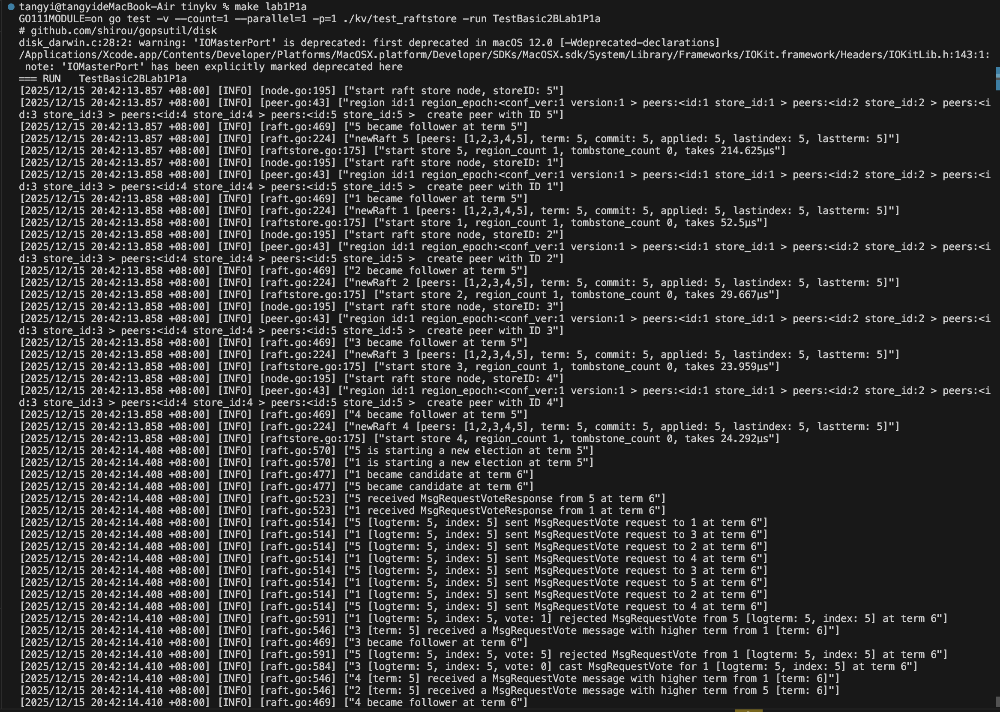

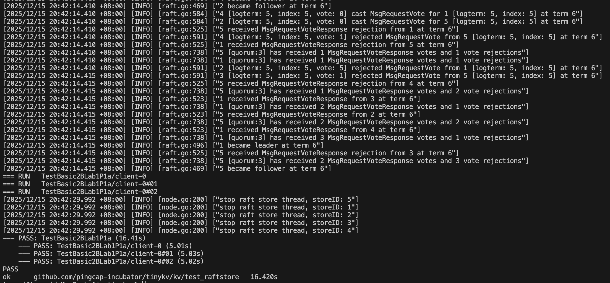

后面的测试无需修改代码均能通过，直至 `make lab1P4a`

### lab1P1b

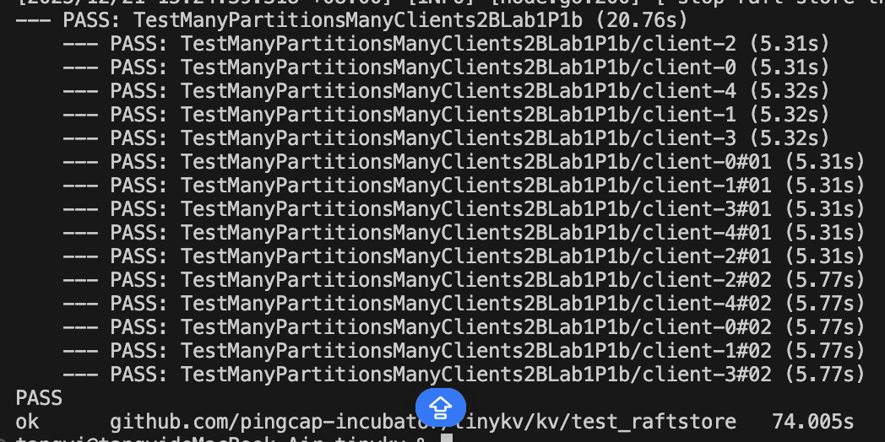

### lab1P2a

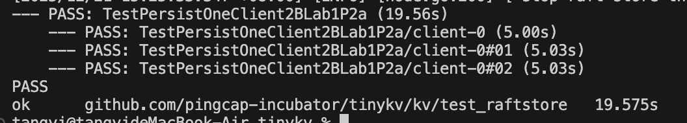

### lab1P2b

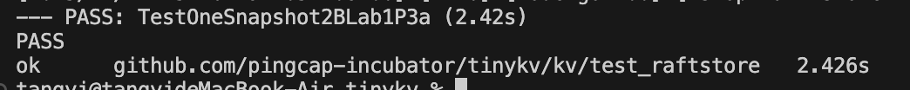

### lab1P3a

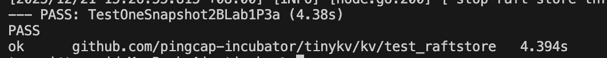

### lab1P4a

```bash
[FATAL] [cluster.go:508] ["have peer: id:2 store_id:2 "] [stack="github.com/pingcap/log.Fatal\n\t/Users/tangyi/go/pkg/mod/github.com/pingcap/log@v0.0.0-20200117041106-d28c14d3b1cd/global.go:59\ngithub.com/pingcap-incubator/tinykv/kv/test_raftstore.(*Cluster).MustNonePeer\n\t/Users/tangyi/Desktop/study/db/project2/db_project2-main/vldb-2021-labs-master/tinykv/kv/test_raftstore/cluster.go:508\ngithub.com/pingcap-incubator/tinykv/kv/test_raftstore.(*Cluster).MustRemovePeer\n\t/Users/tangyi/Desktop/study/db/project2/db_project2-main/vldb-2021-labs-master/tinykv/kv/test_raftstore/cluster.go:470\ngithub.com/pingcap-incubator/tinykv/kv/test_raftstore.TestBasicConfChange3BLab1P4a\n\t/Users/tangyi/Desktop/study/db/project2/db_project2-main/vldb-2021-labs-master/tinykv/kv/test_raftstore/test_test.go:544\ntesting.tRunner\n\t/usr/local/go/src/testing/testing.go:1934"]
FAIL    github.com/pingcap-incubator/tinykv/kv/test_raftstore   22.134s
FAIL
make: *** [lab1P4a] Error 1
```

~~我被这个问题卡了一整周，其中打了退堂鼓十余次，因为实在不想再被 bookstore 折磨一遍，所以选择硬着头皮继续做下去~~

根据排查，下面的这例测试没有过

```go
func TestBasicConfChange3BLab1P4a(t *testing.T) {
	cfg := config.NewTestConfig()
	cluster := NewTestCluster(5, cfg)
	cluster.Start()
	defer cluster.Shutdown()

	cluster.MustTransferLeader(1, NewPeer(1, 1))
	cluster.MustRemovePeer(1, NewPeer(2, 2))
	cluster.MustRemovePeer(1, NewPeer(3, 3))
	cluster.MustRemovePeer(1, NewPeer(4, 4))
	cluster.MustRemovePeer(1, NewPeer(5, 5))

	// now region 1 only has peer: (1, 1)
	cluster.MustPut([]byte("k1"), []byte("v1"))
	MustGetNone(cluster.engines[2], []byte("k1"))

	// add peer (2, 2) to region 1
	cluster.MustAddPeer(1, NewPeer(2, 2))
	cluster.MustPut([]byte("k2"), []byte("v2"))
	cluster.MustGet([]byte("k2"), []byte("v2"))
	MustGetEqual(cluster.engines[2], []byte("k1"), []byte("v1"))
	MustGetEqual(cluster.engines[2], []byte("k2"), []byte("v2"))

	epoch := cluster.GetRegion([]byte("k1")).GetRegionEpoch()
	assert.True(t, epoch.GetConfVer() > 1)

	// peer 5 must not exist
	MustGetNone(cluster.engines[5], []byte("k1"))

	// add peer (3, 3) to region 1
	cluster.MustAddPeer(1, NewPeer(3, 3))
	cluster.MustRemovePeer(1, NewPeer(2, 2))

	cluster.MustPut([]byte("k3"), []byte("v3"))
	cluster.MustGet([]byte("k3"), []byte("v3"))
	MustGetEqual(cluster.engines[3], []byte("k1"), []byte("v1"))
	MustGetEqual(cluster.engines[3], []byte("k2"), []byte("v2"))
	MustGetEqual(cluster.engines[3], []byte("k3"), []byte("v3"))

	// peer 2 has nothing
	MustGetNone(cluster.engines[2], []byte("k1"))
	MustGetNone(cluster.engines[2], []byte("k2"))

	cluster.MustAddPeer(1, NewPeer(2, 2))
	MustGetEqual(cluster.engines[2], []byte("k1"), []byte("v1"))
	MustGetEqual(cluster.engines[2], []byte("k2"), []byte("v2"))
	MustGetEqual(cluster.engines[2], []byte("k3"), []byte("v3"))

	// remove peer (2, 2) from region 1
	cluster.MustRemovePeer(1, NewPeer(2, 2))
	// add peer (2, 4) to region 1
	cluster.MustAddPeer(1, NewPeer(2, 4))
	// remove peer (3, 3) from region 1
	cluster.MustRemovePeer(1, NewPeer(3, 3))

	cluster.MustPut([]byte("k4"), []byte("v4"))
	MustGetEqual(cluster.engines[2], []byte("k1"), []byte("v1"))
	MustGetEqual(cluster.engines[2], []byte("k4"), []byte("v4"))
	MustGetNone(cluster.engines[3], []byte("k1"))
	MustGetNone(cluster.engines[3], []byte("k4"))
}

```

这个测试的流程为:

1. 初始化 5 节点集群，将 Region 1 的 Leader 转移到 Peer (1,1)；
2. 依次移除 Peer (2,2)、Peer (3,3)、Peer (4,4)、Peer (5,5)，让 Region 1 只剩 Peer (1,1)；
3. 写入数据后，验证被移除的 Peer (2) 中无数据；
4. 重新添加 Peer (2,2)，写入新数据并验证数据同步到 Peer (2)；
5. 再次添加 / 移除 Peer，验证数据一致性和 Peer 元数据的正确性。

根据日志的报错，我的代码出现的问题在第一步移除 Peer (2,2) 的环节 ，具体表现为：

1. Raft 集群陷入「选举循环死锁」 ：

- 节点 2 和节点 5 反复发起选举，互相成为 Candidate→ 收到更高 term 的投票请求 → 退化为 Follower→ 再次发起选举，term 从 24 一路涨到 38；
- 集群始终没有 稳定的 Leader ，因为 Leader 刚当选就会被更高 term 的选举请求推翻。

  2. 配置变更命令（移除 Peer (2,2)）无法被提议 / 提交 / 执行 ：

- 没有稳定的 Leader，就无法将「移除 Peer (2,2)」的配置变更日志复制到多数节点；
- 最终测试用例执行 `cluster.MustRemovePeer(1, NewPeer(2, 2))`时，校验发现 Peer (2,2) 仍然存在，触发 `MustNonePeer`的 FATAL 错误（`have peer: id:2 store_id:2`）

在修复代码问题的期间，我尝试过修改 confchange 相关的函数，以及我对于 config 的参数进行过一定的调整，结果发现都没用，回过头来看，才发现我的 `proposeRaftCommand`函数写的有误,下方是我对于 `peer 是否停止`的 return 值，这是我自己包装的

```go
 cb.Done(ErrResp(&util.ErrRegionNotFound{RegionId: d.regionId}))
```

实际上，在 peer.go 已经定义了一个函数,我们可以直接调用

```go
func NotifyReqRegionRemoved(regionId uint64, cb *message.Callback) {
	regionNotFound := &util.ErrRegionNotFound{RegionId: regionId}
	resp := ErrResp(regionNotFound)
	cb.Done(resp)
}
```

对于 hint3，我们需要绑定 Term 和显示回调，我的代码没有完成

```go
errResp := &raft_cmdpb.RaftCmdResponse{} // 空的响应头，没有CurrentTerm
    if !d.peer.Propose(d.ctx.engine.Kv, d.ctx.cfg, cb, msg, errResp) {
        // 错误：直接return，框架不会自动回调
        return
    }
```

这是修改后的对应 hint3 正确部分代码

```go
errResp := &raft_cmdpb.RaftCmdResponse{
        Header: &raft_cmdpb.RaftResponseHeader{
            CurrentTerm: d.Term(), // 绑定当前节点的Term
        },
    }
    // Propose失败后，显式调用回调，避免命令挂起
    if !d.peer.Propose(d.ctx.engine.Kv, d.ctx.cfg, cb, msg, errResp) {
        cb.Done(errResp) // 手动触发回调
        return
    }
```

下附通过的截图

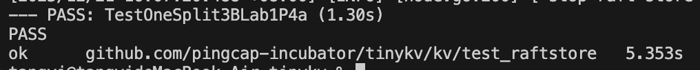

lab1P4b

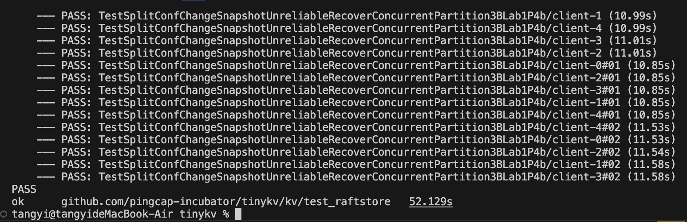

## lab2

### lab2P1

首先根据要求，我们补全 get.go 中的代码缺失内容，下方是提示:

```
// Read 执行 Get 命令的只读逻辑（核心实现部分）
// 实现 Command 接口的 Read 方法，因为是只读命令，WillWrite 返回 nil，因此该方法会被调用
// 参数：txn - 只读 MVCC 事务，用于读取数据
// 返回值：
// 1. interface{}: Get 响应结果（kvrpcpb.GetResponse）
// 2. [][]byte: 只读命令返回 nil
// 3. error: 执行过程中的错误（如锁冲突、读取失败）

// YOUR CODE HERE (lab2).
	// 实验二待实现：检查锁及其可见性（核心逻辑）
	// 提示：使用 mvcc.RoTxn 提供的接口（如 GetLock）检查键是否被锁定
	// 要点：如果键被其他事务锁定，需要返回锁冲突错误；如果是当前事务锁定，可继续读取
	// ========== 步骤1：检查key是否被锁定（核心逻辑） ==========
	// 调用本地RoTxn的GetLock方法，获取key对应的锁（*mvcc.Lock）

// YOUR CODE HERE (lab2).
	// 实验二待实现：查找已提交的数值，将结果设置到响应中
	// 提示：使用 mvcc.RoTxn 提供的接口（如 GetValue）读取指定版本的数值
	// 要点：读取小于等于 startTs 的最新提交版本的数值
```

根据提示，我们能够明白，我们要做以下两步:

1. **第一步** ：用 `RoTxn.GetLock`检查锁，处理锁冲突；
2. **第二步** ：用 `RoTxn.GetValue`读取指定版本的数值，填充响应。

第一步需要使用到 `mvcc.RoTxn.GetLock`（只读事务的锁查询接口）；其逻辑为：

- 键被**其他事务**锁定 → 返回锁冲突错误；
- 键被**当前事务**锁定 → 允许继续读取（自己锁的键，自己可以读）；
- 无锁 → 继续读取。

首先我们需要查看 `mvcc.RoTxn`（只读事务）和 `mvcc.Lock` 的定义，下面只展示和代码撰写相关的部分

`mvcc.RoTxn`的 `GetLock`方法

```go
// mvcc/ro_txn.go（只读事务的核心接口）
type RoTxn struct {
    StartTS uint64 // 只读事务的版本号（即Get请求的Version）
    // 其他存储相关字段...
}

// 获取指定键的锁（如果存在）
func (txn *RoTxn) GetLock(key []byte) (*Lock, error) {
    // 逻辑：从存储中读取该键的预写锁，返回锁对象或nil
}
```

`mvcc.Lock`结构体与 `Info`方法

```go
// mvcc/lock.go
type Lock struct {
    Ts      uint64 // 锁定该键的事务启动TS
    Primary []byte // 主键锁的键
    Ttl     uint64 // 锁超时时间
    Kind    WriteKind // 操作类型（Put/Del）
}

// 将Lock转换为RPC协议的LockInfo（用于返回锁冲突错误）
func (l *Lock) Info(key []byte) *kvrpcpb.LockInfo {
    return &kvrpcpb.LockInfo{
        Key:     key,
        LockTs:  l.Ts,
        Primary: l.Primary,
        Ttl:     l.Ttl,
    }
}
```

`mvcc.KeyError`（封装 RPC 的 KeyError）

```go
// mvcc/error.go
type KeyError struct {
    kvrpcpb.KeyError // 嵌入RPC的KeyError，包含Locked/Conflict/Abort等字段
}

// 实现error接口
func (e *KeyError) Error() string {
    return e.KeyError.String()
}
```

了解了上述的框架代码之后，我们根据 hint 撰写代码，代码的逻辑为:

- `txn.StartTS` 是 Get 请求的版本号（`request.Version`），如果锁的 `Ts`不等于这个值，说明是其他事务的锁，此时读操作需要等待（返回锁冲突错误）；
- 如果锁的 `Ts`等于 `txn.StartTS`，说明是当前事务自己锁的键，允许继续读取（这是 MVCC 的 “读己之写” 特性）。

```
// 1. 调用RoTxn的GetLock接口，获取键的锁
lock, err := txn.GetLock(key)
if err != nil {
    // 内部错误（如存储读取失败），直接返回
    return nil, nil, err
}

// 2. 处理锁冲突：锁存在且不属于当前事务（lock.Ts != txn.StartTS）
if lock != nil && lock.Ts != txn.StartTS {
    // 构造mvcc.KeyError，封装RPC的Locked错误
    keyErr := &mvcc.KeyError{
        KeyError: kvrpcpb.KeyError{
            Locked: lock.Info(key), // 转换为RPC的LockInfo
        },
    }
    return nil, nil, keyErr
}
```

对于第二个)hint，我们需要使用 `mvcc.RoTxn.GetValue`（只读事务的数值查询接口读取**小于等于 `startTs`的最新提交版本**的数值，填充到响应中。

下面展示相关的框架代码:

```go
// mvcc/ro_txn.go
func (txn *RoTxn) GetValue(key []byte) ([]byte, error) {
    // 逻辑：
    // 1. 查找该键的所有已提交写记录（按提交TS降序）；
    // 2. 找到第一个提交TS <= txn.StartTS的记录；
    // 3. 根据记录的操作类型（Put/Del），返回对应的值或nil（Del则返回nil）；
    // 4. 无记录则返回nil。
}
```

这个接口是 MVCC 读操作的核心，已经帮我们实现了 “找最新版本” 的逻辑，我们只需要调用即可。于是，我们可以根据以下逻辑撰写代码:

- `txn.GetValue(key)` 返回的是 “小于等于 `txn.StartTS`的最新值”，完全符合 Get 命令的需求；
- `response.NotFound` 是 RPC 协议的字段，用于告诉客户端 “该键是否存在”（值为 nil 时，可能是未找到，也可能是被删除了，统一标记为 `NotFound: true`）。

```go
// 1. 调用RoTxn的GetValue接口，读取指定版本的数值
value, err := txn.GetValue(key)
if err != nil {
    return nil, nil, err
}

// 2. 填充Get响应结果
response := new(kvrpcpb.GetResponse)
response.Value = value // 读取到的值（nil表示未找到或已删除）
response.NotFound = value == nil // 标记是否找到值（nil则为true）
```

接下来我们要补全 `prewrite.go`的代码，它实现了分布式事务两阶段提交的第一阶段（预写） ，核心功能是批量处理事务的所有写操作（Put/Del），检查冲突和锁，锁定键并暂存数据

根据注释的提示，我们能够了解到 prewrite 的框架:

1. **`PrepareWrites`方法** ：遍历所有 `Mutation`（写操作），调用 `prewriteMutation`处理单个键的预写，收集错误并返回响应；
2. **`prewriteMutation`方法** ：处理单个键的预写（核心逻辑，也是我们需要实现的部分）；
3. **`WillWrite`方法** ：收集所有要写入的键，用于并发锁存器（框架层，只需简单遍历）。

```go
// YOUR CODE HERE (lab2).
// 实验二待实现：检查写冲突（核心逻辑）
// 提示：使用 mvcc.MvccTxn 提供的接口检查是否存在写冲突
// 要点：使用 kvrpcpb.WriteConflict 错误类型表示写冲突，在 KeyError 中设置正确的信息
```

第一个 hint 让我们去查看 `mvcc.MvccTxn`的接口，检测写冲突，用 `WriteConflict`错误类型封装，设置正确的错误信息，且写冲突的定义为:其他事务已经提交了比当前事务启动时间晚的记录（即 `最新提交TS > 当前事务StartTS`）。我们找到:

```
// mvcc/txn.go（可写事务的核心接口）
type MvccTxn struct {
    StartTS uint64 // 事务启动时间戳
    // 其他存储相关字段...
}

// 获取指定键的最新已提交写记录
// 返回值：写记录（*Write）、提交TS（uint64）、错误（error）
func (txn *MvccTxn) MostRecentWrite(key []byte) (*Write, uint64, error) {
    // 逻辑：从存储中读取该键的最新已提交写记录，返回记录、其提交TS、错误
}
```

同时我们需要查看 `kvrpcpb.WriteConflict`和 `kvrpcpb.KeyError`的结构

```go
// proto/pkg/kvrpcpb/kvrpcpb.pb.go
type WriteConflict struct {
    StartTs     uint64 `protobuf:"varint,1,opt,name=start_ts,json=startTs"`
    ConflictTs  uint64 `protobuf:"varint,2,opt,name=conflict_ts,json=conflictTs"`
    Key         []byte `protobuf:"bytes,3,opt,name=key"`
}

type KeyError struct {
    Locked    *LockInfo    `protobuf:"bytes,1,opt,name=locked"`
    Conflict  *WriteConflict `protobuf:"bytes,2,opt,name=conflict"`
    Abort     string       `protobuf:"bytes,3,opt,name=abort"`
    Retryable bool         `protobuf:"varint,4,opt,name=retryable"`
}
```

对应的，我们可以完成 hint1 处的代码填写：

```go
// 1. 调用mvcc.MvccTxn的MostRecentWrite接口，获取最新写记录和提交TS
write, commitTs, err := txn.MostRecentWrite(key)
if err != nil {
    // 内部错误（如存储读取失败），返回第二个返回值（终止整个预写）
    return nil, err
}

// 2. 判断写冲突：最新提交TS > 当前事务StartTS（其他事务已提交更新的记录）
if write != nil && commitTs > txn.StartTS {
    // 3. 构造KeyError，封装WriteConflict错误信息（按Hint要求设置正确字段）
    keyErr := &kvrpcpb.KeyError{
        Conflict: &kvrpcpb.WriteConflict{
            StartTs:    txn.StartTS,  // 当前事务启动TS
            ConflictTs: commitTs,     // 冲突的提交TS
            Key:        key,          // 冲突的键
        },
    }
    // 返回键错误（继续处理其他键）
    return keyErr, nil
}
```

上面的代码实现逻辑为:

- `MostRecentWrite`是 Hint 提示的 “mvcc.MvccTxn 接口”，是检测写冲突的核心工具；
- 写冲突的判断条件是 MVCC 的核心规则： **不能覆盖比自己启动时间晚的已提交记录** ；
- 错误信息严格按照 Hint 要求，用 `WriteConflict`类型封装，并设置 `StartTs`/`ConflictTs`/`Key`三个关键字段。

第二个 hint 的逻辑要求是:

1. 键被**其他事务**锁定 → 返回 `Locked`错误；
2. 键被**当前事务**锁定 → 重复预写请求，忽略（返回成功）；
3. 无锁 → 继续后续逻辑。

同样地，我们查找相关的代码:

```go
// mvcc/txn.go
// 获取指定键的预写锁（如果存在）
func (txn *MvccTxn) GetLock(key []byte) (*Lock, error) {
    // 逻辑：从存储中读取该键的锁，返回锁对象或nil
}

// mvcc/lock.go
type Lock struct {
    Ts      uint64 // 锁定该键的事务启动TS
    Primary []byte // 事务的主键锁
    Ttl     uint64 // 锁超时时间
    Kind    WriteKind // 操作类型
}

// 将Lock转换为RPC的LockInfo（用于返回Locked错误）
func (l *Lock) Info(key []byte) *kvrpcpb.LockInfo {
    return &kvrpcpb.LockInfo{
        Key:     key,
        LockTs:  l.Ts,
        Primary: l.Primary,
        Ttl:     l.Ttl,
    }
}
```

这是我撰写第二段代码的逻辑和代码

- `GetLock`是检测锁的核心接口，符合 Hint 隐含的 “mvcc.MvccTxn 接口” 要求；
- 锁归属的判断依据是 `lock.Ts == txn.StartTS`（锁的 TS 是当前事务的启动 TS）；
- 重复请求的处理是分布式事务的幂等性要求（网络重发请求不会导致错误）。

```go
// 1. 调用mvcc.MvccTxn的GetLock接口，获取键的锁
existingLock, err := txn.GetLock(key)
if err != nil {
    return nil, err
}

// 2. 情况1：被其他事务锁定（lock.Ts != txn.StartTS）→ 返回Locked错误
if existingLock != nil && existingLock.Ts != txn.StartTS {
    keyErr := &kvrpcpb.KeyError{
        Locked: existingLock.Info(key), // 转换为RPC的LockInfo
    }
    return keyErr, nil
}

// 3. 情况2：被当前事务锁定 → 重复请求，忽略（直接返回成功）
if existingLock != nil && existingLock.Ts == txn.StartTS {
    return nil, nil
}
```

第三段代码我们需要查看:

```go
// mvcc/txn.go
// 写入预写锁到存储
func (txn *MvccTxn) PutLock(key []byte, lock *Lock) error {
    // 逻辑：将锁写入事务缓冲区，锁定该键
}

// 暂存Put操作的键值对（预写阶段，数据不对外可见）
func (txn *MvccTxn) PutValue(key []byte, value []byte) error {
    // 逻辑：将值写入事务缓冲区
}

// 暂存Delete操作（标记键为删除状态）
func (txn *MvccTxn) DeleteValue(key []byte) error {
    // 逻辑：标记键为删除，写入事务缓冲区
}

// mvcc/lock.go
// 将RPC的Op转换为内部的WriteKind
func WriteKindFromProto(op kvrpcpb.Op) WriteKind {
    switch op {
    case kvrpcpb.Op_Put:
        return WriteKindPut
    case kvrpcpb.Op_Del:
        return WriteKindDelete
    default:
        panic("unknown op")
    }
}
```

这是我实现的代码和实现逻辑:

1. 将 RPC 操作类型（Put/Del）转换为 MVCC 内部的 `WriteKind`；
2. 构造 `mvcc.Lock`对象，写入锁；
3. 根据操作类型，暂存数据（Put 写值，Del 标记删除）。

```go
// 1. 转换操作类型：RPC Op → MVCC WriteKind
writeKind := mvcc.WriteKindFromProto(mut.Op)

// 2. 构造Lock对象（包含主键、事务TS、TTL、操作类型）
lock := &mvcc.Lock{
    Primary: p.request.PrimaryLock, // 事务的主键锁（由请求传入）
    Ts:      txn.StartTS,           // 当前事务启动TS
    Ttl:     p.request.LockTtl,     // 锁超时时间（由请求传入）
    Kind:    writeKind,             // 操作类型
}

// 3. 写入锁（调用Hint提示的PutLock接口）
txn.PutLock(key, lock)

// 4. 写入数据（根据操作类型处理）
switch mut.Op {
case kvrpcpb.Op_Put:
    txn.PutValue(key, mut.Value) // 暂存Put值
case kvrpcpb.Op_Del:
    txn.DeleteValue(key)         // 暂存Delete标记
}

// 预写成功，返回无错误
return nil, nil
```

根据要求，接下来我们要补全 `commit.go`

Commit 命令的框架与 Prewrite 类似，核心分为三层：

1. **`PrepareWrites`方法** ：全局处理（检查提交 TS 有效性 + 遍历所有键调用 `commitKey`）；
2. **`commitKey`方法** ：处理单个键的提交（核心逻辑，也是我们需要实现的部分）；
3. **`WillWrite`方法** ：收集要写入的键（框架层，简单实现）。

第一个 hint 是要实现 `PrepareWrites`方法，其核心是提交 TS（`commitTs`）必须大于事务启动 TS（`startTs`），否则会导致版本混乱（读操作无法正确识别数据版本）。

因此，对于其的错误处理为:若不满足条件，直接返回内部错误，终止整个提交流程（因为提交 TS 无效是致命错误，无法继续）。

```go
// 1. 获取请求中的提交TS
commitTs := c.request.CommitVersion

// 2. 检查提交TS有效性：commitTs <= startTs → 无效
if commitTs <= c.StartTs() {
    // 3. 返回格式化错误（终止整个提交流程）
    return nil, fmt.Errorf("commitTs %d is not greater than startTs %d", commitTs, c.StartTs())
}

// 4. 遍历所有键，逐个提交
response := new(kvrpcpb.CommitResponse)
for _, k := range c.request.Keys {
    resp, e := commitKey(k, commitTs, txn, response)
    if resp != nil || e != nil {
        return response, e
    }
}
return response, nil
```

在我的代码中:

- `c.StartTs()` 对应事务的启动 TS（来自 `request.StartVersion`），是 Commit 命令的核心属性；
- 错误使用 `fmt.Errorf`返回，无需封装为 `kvrpcpb.KeyError`（因为这是全局致命错误，不是单个键的错误）；
- 遍历所有键调用 `commitKey`，是批量处理的常规逻辑（与 Prewrite 一致）。

第二个要实现函数为 `commitKey`方法 ，是单个键的提交，它是 Commit 命令的核心，包含锁验证 + 边界条件处理 + 写入提交记录 + 释放锁四个步骤。

步骤 1：获取预写锁

```go
// 获取预写阶段写入的锁（如果存在）
lock, err := txn.GetLock(key)
if err != nil {
    return nil, err
}
```

它的参考接口 ：`mvcc.MvccTxn.GetLock`（与 Prewrite 中相同，用于获取键的预写锁）；后续逻辑需要通过锁对象判断归属，以及获取锁的操作类型（`lock.Kind`）。

步骤 2：处理 “锁不存在 / 不属于当前事务” 的边界条件

```go
// YOUR CODE HERE (lab2).
// 实验二待实现：处理锁不存在或不属于当前事务的情况（核心逻辑）
// 要点：
// 1. 检查该键是否有提交/回滚记录（已提交或已回滚，属于重复请求，忽略）
// 2. 如果没有任何记录，返回锁未找到错误
// 3. 处理重复提交请求（已提交则忽略，已回滚则返回错误）
```

我们需要参考的 mvcc 接口为:

```go
// mvcc/txn.go
// 获取该键与当前事务启动TS匹配的写记录（提交/回滚记录）
func (txn *MvccTxn) CurrentWrite(key []byte) (*Write, uint64, error) {
    // 逻辑：查找该键中，启动TS等于当前事务TS的写记录（提交/回滚）
}

// mvcc/write.go
type Write struct {
    StartTS uint64    // 事务启动TS
    Kind    WriteKind // 操作类型（Put/Del/Rollback）
}

// 反射相关：用于设置response的Error字段（框架层保留的逻辑，无需修改）
// reflect.ValueOf(response) → 获取响应的反射值
// reflect.Indirect(respValue) → 解引用指针（因为response是*kvrpcpb.CommitResponse）
// FieldByName("Error") → 获取响应的Error字段（RPC协议定义）
```

同时，我们需要知道 `kvrpcpb.CommitResponse`的结构

```go
type CommitResponse struct {
    Error *KeyError `protobuf:"bytes,1,opt,name=error"`
    // 其他字段...
}
```

这是步骤 2 的代码实现

```go
// 检查锁是否存在/不属于当前事务
if lock == nil || lock.Ts != txn.StartTS {
    // 步骤1：获取该键的当前写记录（提交/回滚）
    currentWrite, _, err := txn.CurrentWrite(key)
    if err != nil {
        return nil, err
    }

    // 步骤2：处理已有记录的情况（Hint要点1、3）
    if currentWrite != nil {
        // 子情况1：记录是回滚类型 → 返回Abort错误（Hint要点3）
        if currentWrite.Kind == mvcc.WriteKindRollback {
            // 用反射设置response的Error字段（框架层要求保留反射逻辑）
            respValue := reflect.ValueOf(response)
            keyError := &kvrpcpb.KeyError{Abort: "transaction has been rolled back"}
            reflect.Indirect(respValue).FieldByName("Error").Set(reflect.ValueOf(keyError))
            return response, nil
        }
        // 子情况2：记录是当前事务的提交记录 → 重复提交，忽略（Hint要点1、3）
        else if currentWrite.StartTS == txn.StartTS {
            return nil, nil
        }
    }

    // 步骤3：无记录 → 返回锁未找到错误（Hint要点2）
    respValue := reflect.ValueOf(response)
    keyError := &kvrpcpb.KeyError{Retryable: fmt.Sprintf("lock not found for key %x", key)}
    reflect.Indirect(respValue).FieldByName("Error").Set(reflect.ValueOf(keyError))
    return response, nil
}
```

后续步骤无需撰写

步骤 3：写入提交记录 + 释放锁

```go
// 1. 构造提交记录（Write结构体）
write := mvcc.Write{StartTS: txn.StartTS, Kind: lock.Kind}

// 2. 写入提交记录（使数据对外可见）
txn.PutWrite(key, commitTs, &write)

// 3. 删除预写锁（释放该键）
txn.DeleteLock(key)

// 4. 提交成功，返回无错误
return nil, nil
```

下面是我的代码测试截图

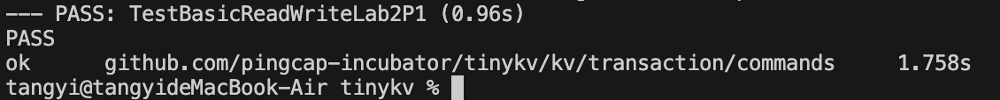

### lab2P2

`Rollback`（事务回滚）是 TinyKV 两阶段提交的重要补充逻辑，用于 **终止未完成的事务** ，清理预写的锁和数据，并写入回滚记录防止后续脏操作。

```go
func rollbackKey(key []byte, txn *mvcc.MvccTxn, response interface{}) (interface{}, error) {
    // 第一步：获取键对应的锁（所有回滚逻辑的起点）
    lock, err := txn.GetLock(key)
    if err != nil {
        return nil, err
    }
    // 日志打印（辅助调试，非核心）
    log.Info("rollbackKey", zap.Uint64("startTS", txn.StartTS), zap.String("key", hex.EncodeToString(key)))
```

回滚的核心是处理 锁的状态 （存在 / 不存在、属于当前事务 / 其他事务），因此第一步必须先获取锁。

处理「锁不存在 / 不属于当前事务」的场景是最复杂的分支，注释里的 Hint 给出了完整的逻辑指引，我们逐句对应代码

```go
// Try to insert a rollback record if there's no correspond records, use `mvcc.WriteKindRollback` to represent
// the type. Also the command could be stale that the record is already rolled back or committed.
// If there is no write either, presumably the prewrite was lost. We insert a rollback write anyway.
// if the key has already been rolled back, so nothing to do.
// If the key has already been committed. This should not happen since the client should never send both
// commit and rollback requests.
// There is no write either, presumably the prewrite was lost. We insert a rollback write anyway.
```

先获取键的最新写记录（判断事务是否已提交 / 回滚）,必须先通过 `txn.CurrentWrite`获取最新的写记录

```go
if lock == nil || lock.Ts != txn.StartTS {
    // 第一步：获取最新写记录（existingWrite：提交/回滚记录；ts：提交时间戳）
    existingWrite, ts, err := txn.CurrentWrite(key)
    if err != nil {
        return nil, err
    }
```

`If there is no write either, presumably the prewrite was lost. We insert a rollback write anyway.` → 无写记录时，无论如何都要写入回滚记录。

`use mvcc.WriteKindRollback to represent the type` → 回滚记录的 `Kind`必须设为 `mvcc.WriteKindRollback`

```go
    if existingWrite == nil {
        // YOUR CODE HERE (lab2).
        // Hint要求：无写记录时，插入回滚记录，使用mvcc.WriteKindRollback
        write := mvcc.Write{StartTS: txn.StartTS, Kind: mvcc.WriteKindRollback}
        txn.PutWrite(key, txn.StartTS, &write)
        return nil, nil
    }
```

`if the key has already been rolled back, so nothing to do.` → 直接返回成功，不执行任何操作

```go
    } else {
        if existingWrite.Kind == mvcc.WriteKindRollback {
            // Hint要求：已回滚，nothing to do
            return nil, nil
        }
```

`If the key has already been committed. This should not happen since the client should never send both commit and rollback requests.` → 构造 `KeyError`提示客户端操作异常，返回错误

```go
        // Hint要求：已提交，客户端不应同时发提交和回滚请求，返回错误
        err := new(kvrpcpb.KeyError)
        err.Abort = fmt.Sprintf("key has already been committed: %v at %d", key, ts)
        respValue := reflect.ValueOf(response)
        reflect.Indirect(respValue).FieldByName("Error").Set(reflect.ValueOf(err))
        return response, nil
    }
}
```

`CheckTxnStatus`（检查事务状态）是 TinyKV 处理**事务超时**和**异常事务**的核心命令，主要由协调者（Coordinator）发起，用于判断事务的主键锁状态，进而执行超时回滚或返回事务状态

TinyKV 的事务模型中， **主键（Primary Key）是事务的核心标识** ，事务的锁状态、提交状态都通过主键来判断，因此第一步必须获取主键的锁。

任何 IO 操作（如 `txn.GetLock`）都需要先处理错误，这是代码健壮性的基本要求

```go
func (c *CheckTxnStatus) PrepareWrites(txn *mvcc.MvccTxn) (interface{}, error) {
    // 获取事务的主键（Primary Key）：事务的锁状态由主键唯一决定，这是协议规定
    key := c.request.PrimaryKey
    // 初始化响应结构体：用于返回事务状态和操作结果
    response := new(kvrpcpb.CheckTxnStatusResponse)

    // 第一步：获取主键对应的锁（所有逻辑的基础）
    lock, err := txn.GetLock(key)
    if err != nil {
        return nil, err
    }
```

```go
// YOUR CODE HERE (lab2).
// Lock has expired, try to rollback it. `mvcc.WriteKindRollback` could be used to
// represent the type. Try using the interfaces provided by `mvcc.MvccTxn`.
```

这是函数的第一个核心分支，注释里的 Hint 给出了完整的操作指引

锁的 `Ts`是事务的启动时间戳，只有当锁的 TS 等于当前命令的 `startTs`（即 `request.LockTs`），才说明这个锁是当前要检查的事务的锁。

锁的超时判断使用 **物理时间** （因为 TTL 是物理时间维度的超时时间），通过 `physical`函数提取时间戳的物理部分（这是 TinyKV 时间戳的规范，由 `tsoutil`包定义）。

```
// 第二步：如果锁存在且属于当前事务（锁的TS等于事务启动TS）
if lock != nil && lock.Ts == txn.StartTS {
    // 判断锁是否超时：锁的物理时间 + TTL < 当前物理时间
    if physical(lock.Ts)+lock.Ttl < physical(c.request.CurrentTs) {
```

`Lock has expired, try to rollback it.` → 核心动作是执行回滚，拆分为「清理数据 → 写回滚记录 → 删锁」三步。

`mvcc.WriteKindRollback could be used to represent the type.` → 回滚记录的 `Kind`必须设为 `mvcc.WriteKindRollback`。

`Try using the interfaces provided by mvcc.MvccTxn.` → 直接调用 `txn.DeleteValue`/`txn.PutWrite`/`txn.DeleteLock`这些接口（MVCC 层封装的基础操作）。

```go
            // YOUR CODE HERE (lab2).
            // 锁已超时，执行回滚操作：使用mvcc.WriteKindRollback标记回滚记录
            // 提示：使用mvcc.MvccTxn提供的接口完成数据清理、回滚记录写入和锁删除

            // 打印日志：辅助调试，记录回滚的关键信息（非必需，但建议添加）
            log.Info("checkTxnStatus rollback the primary lock as it's expired",
                zap.Uint64("lock.TS", lock.Ts),
                zap.Uint64("physical(lock.TS)", physical(lock.Ts)),
                zap.Uint64("txn.StartTS", txn.StartTS),
                zap.Uint64("currentTS", c.request.CurrentTs),
                zap.Uint64("physical(currentTS)", physical(c.request.CurrentTs)))

            // 1. 清理预写的Put类型数据（Hint隐含要求：回滚需要清理脏数据）
            if lock.Kind == mvcc.WriteKindPut {
                txn.DeleteValue(key)
            }
            // 2. 写入回滚记录：按Hint要求，使用mvcc.WriteKindRollback标记类型
            write := mvcc.Write{StartTS: txn.StartTS, Kind: mvcc.WriteKindRollback}
            txn.PutWrite(key, txn.StartTS, &write)
            // 3. 删除主键的锁：按Hint要求，使用mvcc.MvccTxn的接口释放锁
            txn.DeleteLock(key)
            // 4. 设置响应动作：表示锁超时后执行了回滚（协议要求，供客户端判断）
            response.Action = kvrpcpb.Action_TTLExpireRollback
```

锁未超时说明事务还在正常进行中，因此返回 `NoAction`，并把锁的 TTL 返回给客户端，让客户端可以等待后再次检查

```go
    } else {
        // 锁未超时，不执行任何操作
        response.Action = kvrpcpb.Action_NoAction
        // 返回锁的剩余TTL，供客户端判断是否需要再次检查（协议要求）
        response.LockTtl = lock.Ttl
    }

    return response, nil
}
```

当主键锁不存在时，需要检查事务的写记录状态，注释里的 Hint 同样给出了明确指引

```go
// YOUR CODE HERE (lab2).
// The lock never existed, it's still needed to put a rollback record on it so that
// the stale transaction commands such as prewrite on the key will fail.
// Note try to set correct `response.Action`,
// the action types could be found in kvrpcpb.Action_xxx.
```

获取主键的最新写记录：锁不存在时，事务的状态只能通过「最新写记录」判断（记录可能是提交、回滚或无），`txn.CurrentWrite`是 MVCC 层提供的获取最新写记录的接口

```go
// 第三步：锁不存在时，检查主键的最新写记录（提交/回滚）
existingWrite, commitTs, err := txn.CurrentWrite(key)
if err != nil {
    return nil, err
}
```

`The lock never existed, it's still needed to put a rollback record on it` → 必须写入回滚记录，阻止后续的预写操作（避免脏数据）。

`so that the stale transaction commands such as prewrite on the key will fail` → 回滚记录的作用是让过期的预写命令失败，这是写入回滚记录的核心目的。

`Note try to set correct response.Action` → 必须设置 `kvrpcpb.Action_LockNotExistRollback`（对应锁不存在的回滚场景）

```go
// 情况1：没有任何写记录（预写请求丢失）
if existingWrite == nil {
    // YOUR CODE HERE (lab2).
    // 锁从未存在过，需要写入回滚记录，防止过期的预写命令执行成功
    // 注意：设置正确的response.Action（参考kvrpcpb.Action_xxx枚举）

    // 1. 写入回滚记录：按Hint要求，防止过期预写操作
    write := mvcc.Write{StartTS: txn.StartTS, Kind: mvcc.WriteKindRollback}
    txn.PutWrite(key, txn.StartTS, &write)
    // 2. 设置响应动作：按Hint要求，使用正确的Action枚举（LockNotExistRollback）
    response.Action = kvrpcpb.Action_LockNotExistRollback
    return response, nil
}
```

后续的代码无需撰写，在第一次检验的时候，我发现我的代码始终报错

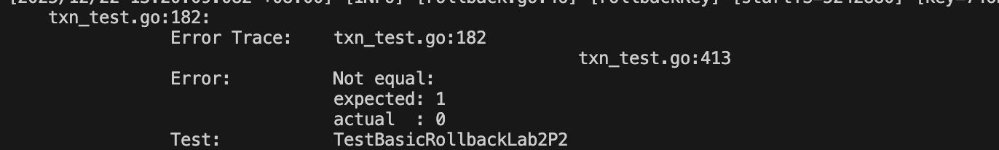

`CheckTxnStatus`和 `Rollback`的核心作用是 **写入回滚记录** ，阻止后续的预写操作；

如果 Prewrite 阶段不检查这个回滚记录，那么即使事务已经被回滚，客户端仍然可以发起预写请求并成功，这直接违反了 TinyKV 的事务协议；且 P2 的测试用例中大量包含「事务回滚后再次预写」的场景，缺失这个检查会让这些测试用例的预期结果和实际结果完全不符，从而导致我的代码没有过

后续，我在 prewrite.go 中增加了一段代码

```go
currentWrite, _, err := txn.CurrentWrite(key)
if err != nil {
    return nil, err
}
if currentWrite != nil && currentWrite.Kind == mvcc.WriteKindRollback {
    // 事务已回滚，拒绝预写
    keyError := &kvrpcpb.KeyError{
        Abort: "transaction has been rolled back",
    }
    return keyError, nil
}
```

最终过了测试

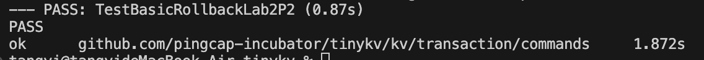

### lab2P3

`ResolveLock`的核心是**根据事务的最终状态（提交 / 回滚），遍历所有遗留锁，调用对应的 `commitKey`或 `rollbackKey`处理单个键**

`ResolveLockRequest`中 `CommitVersion`为非 0 时表示事务已提交，为 0 时表示事务已回滚；

处理每个键时需要传递正确的参数（如提交版本、响应结构体）；

若某个键处理失败，需立即返回错误。

我们只需要根据刚刚补全的两个函数的返回值，按照 hint 补全代码即可

```go
for _, kl := range rl.keyLocks {
		// YOUR CODE HERE (lab2).
		// 核心逻辑：
		// 1. 如果事务已提交（commitTs > 0），调用commitKey提交该键的锁
		// 2. 如果事务已回滚（commitTs == 0），调用rollbackKey回滚该键的锁
		// 3. 处理每个键的返回结果，若有错误则立即返回
		log.Debug("resolve key", zap.String("key", hex.EncodeToString(kl.Key)))

		// 步骤1：判断事务状态，执行对应的操作
		var resp interface{}
		var err error
		if commitTs > 0 {
			// 事务已提交：调用commitKey提交单个键
			// 参数：键、提交版本、可写事务、响应结构体
			resp, err = commitKey(kl.Key, commitTs, txn, response)
		} else {
			// 事务已回滚：调用rollbackKey回滚单个键
			// 参数：键、可写事务、响应结构体
			resp, err = rollbackKey(kl.Key, txn, response)
		}

		// 步骤2：处理操作结果，若有错误则立即返回
		if err != nil {
			return nil, err
		}
		if resp != nil {
			// 有响应（表示存在错误信息），返回该响应
			return resp, nil
		}
	}

```

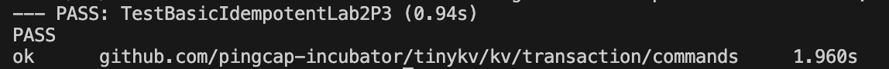

### lab2P4

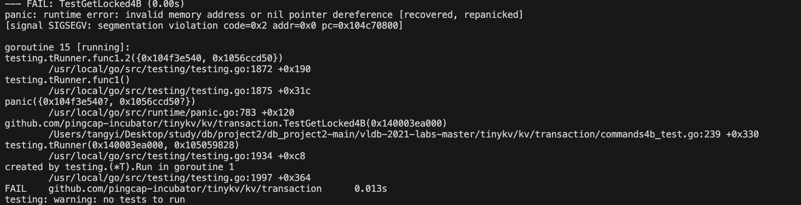

我发现是在我的 get.go 中，触发了 `mvcc.KeyError`错误 ，而 `TestGetLocked4B`测试用例预期的是返回 `nil`,错误应该通过响应体返回，而不是应该返回函数错误

```go
keyErr := &mvcc.KeyError{
    KeyError: kvrpcpb.KeyError{Locked: lock.Info(key)},
}
return nil, nil, keyErr
```

应该把 keyErr 存在响应体中，而不是修改函数返回值

```go
keyError := &kvrpcpb.KeyError{Locked: lock.Info(key)}
response.Error = keyError // 错误存在响应体中，但函数无错误返回
return response, nil, nil // 第三个返回值是nil
```

修改后通过测试

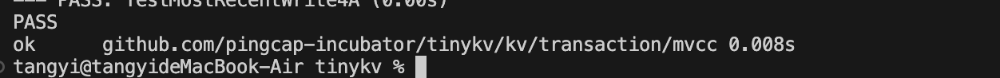

## lab3

根据要求，我们首先查看并理解 `commit`函数

```go
// Commit 是分布式事务提交的入口方法，实现 Percolator 协议的两阶段提交
// 核心流程：
//  1. 检查事务是否有效
//  2. 创建两阶段提交器（twoPhaseCommitter）
//  3. 准备要提交的变更数据（mutations）
//  4. 执行两阶段提交：
//     4.1 Prewrite 阶段（预写，写入数据和锁）
//     4.2 Commit 阶段（提交，清理锁，使数据可见）
//     4.3 若提交失败，执行 Cleanup 阶段（回滚，清理预写的数据和锁）
func (txn *tikvTxn) Commit(ctx context.Context) error {
	// 检查事务是否有效（已关闭/已提交/已回滚则返回错误）
	if !txn.valid {
		return kv.ErrInvalidTxn
	}
	// 无论提交成功或失败，最终都关闭事务（标记为无效）
	defer txn.close()

	// 注入失败点：模拟提交错误（用于测试异常场景）
	failpoint.Inject("mockCommitError", func(val failpoint.Value) {
		if val.(bool) && kv.IsMockCommitErrorEnable() {
			kv.MockCommitErrorDisable()
			failpoint.Return(errors.New("mock commit error"))
		}
	})

	// connID 用于日志记录，标识当前数据库连接（从上下文获取）
	var connID uint64
	val := ctx.Value(sessionctx.ConnID)
	if val != nil {
		connID = val.(uint64)
	}

	var err error
	// 获取或创建两阶段提交器
	committer := txn.committer
	if committer == nil {
		// 初始化两阶段提交器，关联当前事务和连接 ID
		committer, err = newTwoPhaseCommitter(txn, connID)
		if err != nil {
			return errors.Trace(err)
		}
	}
	// 初始化要提交的 Key 和变更数据（从联合存储中提取脏数据）
	if err := committer.initKeysAndMutations(); err != nil {
		return errors.Trace(err)
	}
	// 如果没有要提交的 Key，直接返回（空事务）
	if len(committer.keys) == 0 {
		return nil
	}

	// 执行两阶段提交的核心逻辑
	err = committer.execute(ctx)
	return errors.Trace(err)
}
```

接着，根据提示，我们需要完成 `GroupKeysByRegion` 函数

```go
// GroupKeysByRegion 根据每个 Key 所属的 Region 将 Key 集合进行分组。
// 特别地，该函数还会返回第一个 Key 对应的 Region（这个 Region 对应的 Key 可作为
// 'PrimaryLockKey'（主锁 Key），需要优先于其他 Key 进行提交）。
// 传入的过滤函数可用于筛选掉不需要的 Key。
// 返回值依次为：分组后的 Key 集合（键为 Region 的版本唯一标识，值为对应 Region 下的 Key 列表）、
// 第一个 Key 所属的 Region 版本唯一标识、执行过程中产生的错误（若无错误则为 nil）。
//
// 可借助辅助函数 `RegionCache.LocateKey` 来获取单个 Key 所属的 Region 信息。
func (c *RegionCache) GroupKeysByRegion(bo *Backoffer, keys [][]byte, filter func(key, regionStartKey []byte) bool) (map[RegionVerID][][]byte, RegionVerID, error) {
	// 此处为 lab3 待实现代码
	// panic("YOUR CODE HERE")
	return nil, RegionVerID{}, nil
}
```

我们根据 hint，查看辅助函数

```go
// LocateKey searches for the region and range that the key is located.
func (c *RegionCache) LocateKey(bo *Backoffer, key []byte) (*KeyLocation, error) {
	r, err := c.findRegionByKey(bo, key, false)
	if err != nil {
		return nil, err
	}
	return &KeyLocation{
		Region:   r.VerID(),
		StartKey: r.StartKey(),
		EndKey:   r.EndKey(),
	}, nil
}

```

我们根据 hint，按照下列思路填写代码

初始化数据结构 ：创建一个 `map` 用于存储「Region 标识 -> 对应 Key 列表」的分组结果，同时定义变量记录第一个 Key 对应的 Region 的 ID

```go
groups := make(map[RegionVerID][][]byte)
var firstRegion RegionVerID
```

遍历所有 Key ：对每个 Key 执行以下操作：

调用 `LocateKey` 获取该 Key 所属的 Region 信息（包含 Region 标识、起始 / 结束 Key）。

```go
for i, key := range keys {
		// 调用LocateKey方法，获取当前key所属的区域信息
		loc, err := c.LocateKey(bo, key)
		if err != nil {
			// 若获取区域信息失败，返回nil、空区域ID和包装后的错误
			return nil, RegionVerID{}, errors.Trace(err)
		}

```

使用传入的 `filter` 函数过滤掉不需要的 Key。

```go
// 如果传入了过滤函数，执行过滤逻辑：若过滤函数返回true，则跳过当前key
		if filter != nil && filter(key, loc.StartKey) {
			continue
		}
```

将符合条件的 Key 加入对应 Region 的分组中。

```
groups[loc.Region] = append(groups[loc.Region], key)
```

处理第一个 Key 的 Region ：记录第一个有效 Key 对应的 Region。

```
// 记录第一个key对应的区域版本ID（仅在遍历第一个key时执行）
		if i == 0 {
			firstRegion = loc.Region
		}
```

错误处理 ：如果某个 Key 定位 Region 失败，直接返回错误。

```go
if err != nil {
			// 若获取区域信息失败，返回nil、空区域ID和包装后的错误
			return nil, RegionVerID{}, errors.Trace(err)
		}
```

接下来我们要完成 `buildPrewriteRequest`

根据 hint

```
// Build the prewrite request from the input batch,
	// should use `twoPhaseCommitter.primary` to ensure that the primary key is not empty.
	// YOUR CODE HERE (lab3).
```

我们需要查看相关结构体

```
// twoPhaseCommitter executes a two-phase commit protocol.
type twoPhaseCommitter struct {
	store     *TinykvStore
	txn       *tikvTxn
	startTS   uint64
	keys      [][]byte
	mutations map[string]*mutationEx
	lockTTL   uint64
	commitTS  uint64
	connID    uint64 // connID is used for log.
	cleanWg   sync.WaitGroup
	txnSize   int

	primaryKey []byte

	mu struct {
		sync.RWMutex
		undeterminedErr error // undeterminedErr saves the rpc error we encounter when commit primary key.
		committed       bool
	}
	// regionTxnSize stores the number of keys involved in each region
	regionTxnSize map[uint64]int
}
```

`buildprewriterequest`一共分为 4 步实现

```go
// 步骤1：声明预写请求对象，后续填充参数
    var req *pb.PrewriteRequest

    // 步骤2：初始化Mutation切片，容量为batch中key的数量（优化内存分配）
    mutations := make([]*pb.Mutation, 0, len(batch.keys))

    // 步骤3：遍历批次中的所有key，提取对应的变更信息（Mutation）
    for _, key := range batch.keys {
        // 从提交器的mutation映射中获取当前key的变更数据（比如插入、更新、删除）
        mut := c.mutations[string(key)]
        // 将变更数据添加到切片中，作为预写请求的核心数据
        mutations = append(mutations, &mut.Mutation)
    }

    // 步骤4：填充预写请求的核心参数，构建完整的PrewriteRequest
    req = &pb.PrewriteRequest{
        Mutations:    mutations,    // 当前批次的所有数据变更
        PrimaryLock:  c.primary(), // 事务的主锁key（通过primary()方法确保非空）
        StartVersion: c.startTS,   // 事务的起始版本号（TiDB的MVCC版本，通常是时间戳）
        LockTtl:      c.lockTTL,   // 锁的TTL（过期时间），防止锁一直占用资源
    }
```

接下来实验报告要我们读取 `func (actionPrewrite) handleSingleBatch`

```go
func (actionPrewrite) handleSingleBatch(c *twoPhaseCommitter, bo *Backoffer, batch batchKeys) error {
	// 步骤1：调用构建方法，生成当前批次的预写请求
	req := c.buildPrewriteRequest(batch)

	// 循环处理：预写操作可能因区域错误、锁冲突等原因失败，需要重试
	for {
		// 步骤2：发送预写请求到TiKV节点
		// 参数说明：bo（退避器）、req（预写请求）、batch.region（目标Region）、readTimeoutShort（短超时时间）
		resp, err := c.store.SendReq(bo, req, batch.region, readTimeoutShort)
		if err != nil {
			// 发送请求失败，包装并返回错误
			return errors.Trace(err)
		}

		// 步骤3：提取响应中的区域错误（RegionError）
		regionErr, err := resp.GetRegionError()
		if err != nil {
			return errors.Trace(err)
		}

		// 处理区域错误（比如Region缓存失效、Region分裂/迁移等）
		if regionErr != nil {
			// 背景说明：Region信息是从本地缓存读取的，因此需要处理缓存失效的情况
			// 步骤3.1：执行退避策略（BoRegionMiss类型），等待后重试
			err = bo.Backoff(BoRegionMiss, errors.New(regionErr.String()))
			if err != nil {
				return errors.Trace(err)
			}
			// 步骤3.2：重新拆分key并再次执行预写（因为Region可能已分裂，原批次的key可能归属不同Region）
			err = c.prewriteKeys(bo, batch.keys)
			return errors.Trace(err)
		}

		// 步骤4：检查响应体是否为空（空响应表示TiKV返回异常）
		if resp.Resp == nil {
			return errors.Trace(ErrBodyMissing)
		}

		// 步骤5：将响应体断言为预写响应类型，提取具体结果
		prewriteResp := resp.Resp.(*pb.PrewriteResponse)
		keyErrs := prewriteResp.GetErrors()

		// 步骤6：如果没有key级别的错误，说明预写成功，返回nil
		if len(keyErrs) == 0 {
			return nil
		}

		// 步骤7：处理key级别的错误（主要是锁冲突错误）
		var locks []*Lock
		for _, keyErr := range keyErrs {
			// 步骤7.1：从key错误中提取锁信息（这些锁是其他事务遗留的）
			lock, err1 := extractLockFromKeyErr(keyErr)
			if err1 != nil {
				return errors.Trace(err1)
			}
			// 记录日志：预写过程中遇到的锁信息
			logutil.BgLogger().Debug("prewrite encounters lock",
				zap.Uint64("conn", c.connID),
				zap.Stringer("lock", lock))
			// 将锁添加到切片，后续统一处理
			locks = append(locks, lock)
		}

		// 背景说明：预写时若遇到其他事务遗留的重叠锁，TiKV会返回key错误。
		// 这些事务的状态是未知的（可能提交、可能回滚），需要解析锁的状态并处理。
		// 步骤8：解析锁的状态并解决锁冲突（ResolveLocks会检查锁所属事务的状态，然后释放或保留锁）
		// 参数说明：bo（退避器）、0（callerStartTS，设为0表示不更新minCommitTS）、locks（待解析的锁列表）
		msBeforeExpired, _, err := c.store.lockResolver.ResolveLocks(bo, 0, locks)
		if err != nil {
			return errors.Trace(err)
		}

		// 步骤9：如果锁还未过期，执行退避策略，等待锁过期后重试预写
		if msBeforeExpired > 0 {
			err = bo.BackoffWithMaxSleep(BoTxnLock, int(msBeforeExpired), errors.Errorf("2PC prewrite lockedKeys: %d", len(locks)))
			if err != nil {
				return errors.Trace(err)
			}
		}

		// 循环继续：退避后重新发送预写请求
	}
}
```

根据上述代码仿照 actioncommit 和 actioncleanup 阶段的 handelsingleBatch 函数的撰写

但是在 prewrite 阶段，我们还可以调用 `buildPrewriteRequest`来请求，后面两个函数无法调用类似的函数，只能查找相关的结构体，手动构建请求

```go
// Commit is the second phase of 2pc. The client must have successfully prewritten
// the transaction to all nodes. If all keys are locked by the given transaction,
// then the commit should succeed. If any keys are locked by a different
// transaction or are not locked at all (rolled back or expired), the commit
// fails.
type CommitRequest struct {
	Context *Context `protobuf:"bytes,1,opt,name=context" json:"context,omitempty"`
	// Identifies the transaction, must match the start_version in the transaction's
	// prewrite request.
	StartVersion uint64 `protobuf:"varint,2,opt,name=start_version,json=startVersion,proto3" json:"start_version,omitempty"`
	// Must match the keys mutated by the transaction's prewrite request.
	Keys [][]byte `protobuf:"bytes,3,rep,name=keys" json:"keys,omitempty"`
	// Must be greater than start_version.
	CommitVersion        uint64   `protobuf:"varint,4,opt,name=commit_version,json=commitVersion,proto3" json:"commit_version,omitempty"`
	XXX_NoUnkeyedLiteral struct{} `json:"-"`
	XXX_unrecognized     []byte   `json:"-"`
	XXX_sizecache        int32    `json:"-"`
}
```

```go
// Rollback an un-committed transaction. Will fail if the transaction has already
// been committed or keys are locked by a different transaction. If the keys were never
// locked, no action is needed but it is not an error.  If successful all keys will be
// unlocked and all uncommitted values removed.
type BatchRollbackRequest struct {
	Context              *Context `protobuf:"bytes,1,opt,name=context" json:"context,omitempty"`
	StartVersion         uint64   `protobuf:"varint,2,opt,name=start_version,json=startVersion,proto3" json:"start_version,omitempty"`
	Keys                 [][]byte `protobuf:"bytes,3,rep,name=keys" json:"keys,omitempty"`
	XXX_NoUnkeyedLiteral struct{} `json:"-"`
	XXX_unrecognized     []byte   `json:"-"`
	XXX_sizecache        int32    `json:"-"`
}

```

```
// YOUR CODE HERE (lab3).
	req := &pb.CommitRequest{
		StartVersion:  c.startTS,  // 事务的起始版本号（预写阶段的版本，与PrewriteRequest一致）
		Keys:          batch.keys, // 当前批次中待提交的key列表（同一Region）
		CommitVersion: c.commitTS, // 事务的提交版本号（TiKV的MVCC最终版本）
	}
	// 发送提交请求到TiKV：封装为Commit类型的RPC请求，指定目标Region和短超时时间
	resp, err = sender.SendReq(bo, tikvrpc.NewRequest(tikvrpc.CmdCommit, req, pb.Context{}), batch.region, readTimeoutShort)
```

```go
if regionErr != nil {
		// 执行退避策略（BoRegionMiss类型），等待后重试
		err = bo.Backoff(BoRegionMiss, errors.New(regionErr.String()))
		if err != nil {
			return errors.Trace(err)
		}
		// 若是主锁key且存在不确定性错误，不再重试（无法确定提交状态）
		if isPrimary && c.getUndeterminedErr() != nil {
			return errors.Trace(c.getUndeterminedErr())
		}
		// 重新拆分key并执行提交操作（Region可能已分裂）
		err = c.commitKeys(bo, batch.keys)
		return errors.Trace(err)
	}

	// 情况3：响应体为空
	if resp.Resp == nil {
		return errors.Trace(ErrBodyMissing)
	}

	// 情况4：解析提交响应，处理业务错误
	commitResp := resp.Resp.(*pb.CommitResponse)
	if commitResp.Error != nil {
		return errors.Errorf("commit failed: %v", commitResp.Error)
	}
```

接下来要完成 lock_resolver.go 的两个函数 ，主要就是根据 hint 构建 request

```
// build the request
	// YOUR CODE HERE (lab3).
	req = tikvrpc.NewRequest(tikvrpc.CmdCheckTxnStatus, &kvrpcpb.CheckTxnStatusRequest{
		PrimaryKey: primary,
		LockTs:     txnID,
		CurrentTs:  currentTS,
	}, kvrpcpb.Context{})
```

然后根据 hint,接收锁，将锁的信息持久化到结构体上

```
status.action = cmdResp.Action
		status.ttl = cmdResp.LockTtl
		status.commitTS = cmdResp.CommitVersion
		if status.ttl == 0 {
			lr.saveResolved(txnID, status)
		}
```

~~后面的一个函数的 hint 甚至没有写完整 😅~~

这是后一个函数的 hint

```go
// resolveLock resolve the lock for the given transaction status which is checked from primary key.
// If status is committed, the secondary should also be committed.
// If status is not committed and the

```

根据要求，进行 commint 的判断，若否，执行回滚，然后响应

```go
// build the request
		// YOUR CODE HERE (lab3).
		if status.IsCommitted() {
			// Transaction is committed, resolve lock with commit version
			req = tikvrpc.NewRequest(tikvrpc.CmdResolveLock, &kvrpcpb.ResolveLockRequest{
				StartVersion:  l.TxnID,
				CommitVersion: status.CommitTS(),
			}, kvrpcpb.Context{})
		} else {
			// Transaction is not committed, resolve lock without commit version (rollback)
			req = tikvrpc.NewRequest(tikvrpc.CmdResolveLock, &kvrpcpb.ResolveLockRequest{
				StartVersion: l.TxnID,
			}, kvrpcpb.Context{})
		}
```

最后需要完成 snapshot 的 get 函数

```go
// 你需要在此处处理key相关的错误
            // 若该key错误是由锁引起的，存在两种可能的情况：
            //   1. 对应的事务正在提交中，等待一段时间后重试即可。
            //   2. 对应的事务已异常终止但遗留了部分锁，需要解析并处理这些锁。
            // 请在此处编写代码（实验三要求）。
```

```go
if lock != nil {
				// 2. 封装锁为本地Lock对象
				l := NewLock(lock)
				// 3. 调用ResolveLocks解析锁（查询锁所属事务的状态并处理）
				msBeforeTxnExpired, err := cli.ResolveLocks(bo, s.version.Ver, []*Lock{l})
				if err != nil {
					return nil, errors.Trace(err)
				}
				// 4. 若锁所属事务仍在进行中（还有过期时间），执行退避等待
				if msBeforeTxnExpired > 0 {
					err = bo.BackoffWithMaxSleep(boTxnLockFast, int(msBeforeTxnExpired), errors.New(lock.String()))
					if err != nil {
						return nil, errors.Trace(err)
					}
				}
				// 5. 锁处理完成后，重试读操作（continue进入下一次循环）
				continue
			}
			// 6. 若不是锁错误，返回未知错误
			return nil, errors.Errorf("unexpected key error: %v", keyErr)
```

在测试代码的过程中，我遇到了许多版本冲突的问题，导致许多包没有下载，当我重新装包之后，项目有一千多的报错，同时有很多函数的用法被修改，于是我重新从 github 上拉取我上传的代码（代码及时备份很重要），然后发现 makfile 中已经包含了对 failpoint-enable 的开启

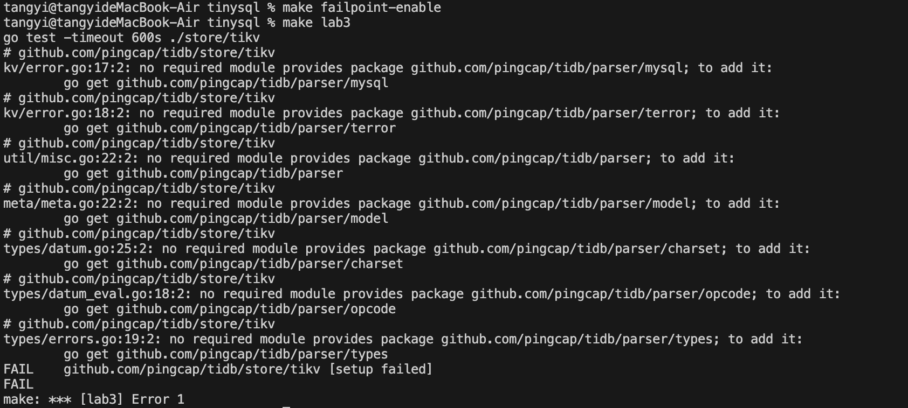

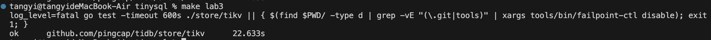

## lab4

### lab4a

lab4A 需要写代码的地方有很多，sessionctx/context.go 和 executor/simple.go 已经完整，需要补全 server/conn.go、session/session.go、executor/compiler.go、executor/adapter.go、session/tidb.go 等

executor 模块（executor/executor.go）

这个模块的修改主要是完成从物理计划到执行器的构建、执行器初始化，以及无返回结果执行器的处理逻辑，是 SQL 执行的核心环节。

ExecStmt.Exec 方法：构建执行器（步骤 I.4.1）

```go
// 原代码：panic("YOUR CODE HERE")
e, err = a.buildExecutor()
if err != nil {
    return nil, err
}
```

修改逻辑 / 理由：`buildExecutor`方法的作用是从物理计划（Plan）生成对应的执行器（Executor），这是 SQL 从逻辑计划到实际执行的关键步骤。必须先完成执行器的构建，才能进行后续的打开、执行操作，同时需要处理构建过程中可能出现的错误，避免程序崩溃。

ExecStmt.Exec 方法：打开执行器（步骤 I.4.2）

原代码是 panic 占位符，修改后补充了执行器初始化的逻辑：

```go
// 原代码：panic("YOUR CODE HERE")
err = e.Open(ctx)
if err != nil {
    terror.Call(e.Close)
    return nil, err
}
```

修改逻辑 / 理由：TiDB 的执行器遵循 “构建 → 打开 → 执行 → 关闭” 的生命周期，`Open`方法用于初始化执行器的资源，比如连接 KV 存储、创建数据游标、初始化表达式等。如果 `Open`操作失败，需要调用 `Close`方法释放已占用的资源，防止内存泄漏或资源残留，之后返回错误信息。

ExecStmt.handleNoDelay 方法：处理无返回结果的执行器（步骤 I.4.3）

```go
// 原代码：panic("YOUR CODE HERE") + return true, nil, nil
r, err := a.handleNoDelayExecutor(ctx, e)
return true, r, err
```

修改逻辑 / 理由：`toCheck.Schema().Len() == 0`表示执行器没有返回结果（比如 INSERT、UPDATE、DELETE 语句），这类语句不需要返回结果集给上层，而是需要立即执行并完成处理。`handleNoDelayExecutor`是专门处理这类无返回结果执行器的方法，因此这里替换为调用该方法，并返回处理后的结果（是否处理成功、结果集、错误）。

ExecStmt.handleNoDelayExecutor 方法：循环执行无返回结果的执行器（步骤 I.4.3.1）

```go
// 原代码：panic("YOUR CODE HERE")
chk := newFirstChunk(e)
for {
    err = e.Next(ctx, chk)
    if err != nil {
        return nil, err
    }
    if chk.NumRows() == 0 {
        break
    }
    chk.Reset()
}
```

修改逻辑 / 理由：TiDB 的执行器基于迭代器模式，必须调用 `Next`方法才能驱动执行器执行实际逻辑。对于无返回结果的执行器，需要循环调用 `Next`直到没有数据返回：首先创建空的 Chunk（TiDB 中存储数据的载体），然后循环调用 `Next`方法执行逻辑，若 Chunk 中没有数据则表示执行完成，退出循环；若有数据（防御性处理，无返回结果执行器理论上不会有数据），则重置 Chunk 继续循环，确保执行器的逻辑被完整执行。

session 模块（session/session.go）

这个模块的修改主要是处理会话中的语句执行、事务的提交与回滚，是 SQL 执行的会话层面控制。

finishStmt 函数：自动提交事务（步骤 I.5.2.1）

```go
// 原代码：panic("YOUR CODE HERE")
err = se.CommitTxn(ctx)
if err != nil {
    if _, ok := sql.(*executor.ExecStmt).StmtNode.(*ast.CommitStmt); ok {
        err = errors.Annotatef(err, "previous statement: %s", se.GetSessionVars().PrevStmt)
    }
    return err
}
return nil
```

修改逻辑 / 理由：`!sessVars.InTxn()`表示当前处于 TiDB 默认的自动提交模式，每条语句都是一个独立的事务。此时需要在语句执行完成后调用 `CommitTxn`提交事务，确保语句的修改被持久化到存储中。如果是 `Commit`语句本身失败，需要添加上一条语句的上下文信息，方便调试错误，之后返回错误信息。

runStmt 函数：执行语句（步骤 I.3.3）

```go
// 原代码：panic("YOUR CODE HERE")
rs, err = s.Exec(ctx)
sessVars.TxnCtx.StatementCount++
```

修改逻辑 / 理由：`s.Exec(ctx)`是调用语句的核心执行方法（即 `ExecStmt.Exec`），会返回执行后的结果集（RecordSet）和错误信息，这是会话中执行 SQL 语句的核心步骤。执行完成后需要增加事务中的语句计数（`StatementCount`），用于限制单个事务中的语句数量，防止大量语句堆积导致内存溢出（OOM）。

runStmt 函数：语句级提交（步骤 I.3.4）

```go
// 原代码：panic("YOUR CODE HERE")
se.StmtCommit()
```

修改逻辑 / 理由：在显式事务中（`sessVars.InTxn() == true`），每条语句执行成功后需要调用 `StmtCommit`进行语句级提交，这是 TiDB 的事务机制之一，作用是保存当前语句的更改（但事务并未最终提交，直到执行 COMMIT 语句）。如果语句执行失败，会调用 `StmtRollback`回滚当前语句的更改，因此这里补充 `StmtCommit`逻辑，确保语句的更改被保存。

### lab4b

lab4 基于如下测试表和 INSERT 语句展开：

```sql
create table t(id int primary key, val int);
-- 普通插入：直接写入常量值
insert into t values(1, 1), (10, 10), (100, 100);
-- 从查询结果插入：基于已有表数据生成新数据写入
insert into t(id, val) select id + 1, val + 1 from t;
```

INSERT 语句的执行由 `executor/insert.go` 中的 `InsertExec` 结构体主导，其核心调用流程如下：

1. **构造 InsertExec 结构体**：通过 `executor/builder.go` 的 `executorBuilder.buildInsert` 函数完成构造，期间调用 `InsertValues.initInsertColumns` 生成执行所需的列信息。
2. **初始化执行环境**：调用 `InsertExec.Open` 方法，若为 INSERT ... SELECT 语句，需同时初始化嵌入的 `SelectionExec`（SELECT 语句执行器）。
3. **处理数据写入逻辑**：调用 `InsertExec.Next` 方法，区分普通 INSERT 和 INSERT ... SELECT 两种场景，分别调用 `insertRows`（普通插入）和 `insertRowsFromSelect`（从查询插入）函数。
4. **执行实际数据写入**：上述两个函数均调用 `InsertExec.exec` 方法，逐行处理数据并调用 `InsertValues.addRecord` 函数。
5. **数据落地 membuffer**：`InsertValues.addRecord` 最终调用 `table/tables/tables.go` 的 `TableCommon.AddRecord` 函数，将数据写入内存缓冲区（membuffer）。

executor 构建模块（executor/builder.go）

该模块负责将 INSERT 语法树转换为执行器实例，是 SQL 执行的起始环节。

1. executorBuilder.buildInsert 方法（步骤 II.1）

```go
// executor/builder.go
func (b *executorBuilder) buildInsert(ctx context.Context, insert *ast.InsertStmt) Executor {
    // 原代码：panic("YOUR CODE HERE")
    // 补充逻辑：获取目标表元数据，初始化 InsertExec 结构体
    table, err := b.getTable(insert.Table)
    if err != nil {
        b.err = err
        return nil
    }
    insertExec := &InsertExec{
        ctx:    ctx,
        table:  table,
        values: &InsertValues{},
    }
    // 初始化插入列信息
    insertExec.values.columns = insert.Columns
    if err := insertExec.values.initInsertColumns(table); err != nil {
        b.err = err
        return nil
    }
    // 处理 INSERT ... SELECT 场景的子查询执行器
    if insert.Select != nil {
        insertExec.selectExec = b.buildSelect(insert.Select)
    }
    return insertExec
}
```

**修改逻辑 / 理由**：`buildInsert` 是连接 INSERT 语法树与执行器的关键方法，需要先获取目标表的元数据（表结构、列信息），再初始化 `InsertExec` 核心字段，同时处理 INSERT ... SELECT 场景的子查询执行器构建，为后续执行提供基础。此外，调用 `initInsertColumns` 初始化列信息，确保插入列与表物理列匹配。

InsertValues 模块（executor/insert.go）

该模块负责处理插入列的初始化逻辑，是保证数据写入列匹配的关键。

1. InsertValues.initInsertColumns 方法（步骤 II.1）

```go
// executor/insert.go
func (iv *InsertValues) initInsertColumns(table table.Table) error {
    // 原代码：panic("YOUR CODE HERE")
    // 补充逻辑：映射插入列到表物理列，校验主键列
    if len(iv.columns) == 0 {
        iv.columns = table.Cols()
    }
    iv.cols = make([]*table.Column, len(iv.columns))
    iv.colIndices = make([]int, len(iv.columns))
    for i, colName := range iv.columns {
        col, ok := table.FindColumn(colName)
        if !ok {
            return fmt.Errorf("column %s not found in table", colName)
        }
        iv.cols[i] = col
        iv.colIndices[i] = col.Index
    }
    // 校验主键列是否存在
    pkCol := table.PrimaryKey()
    pkFound := false
    for _, col := range iv.cols {
        if col.Name == pkCol.Name {
            pkFound = true
            break
        }
    }
    if !pkFound {
        return fmt.Errorf("primary key column %s is missing in insert columns", pkCol.Name)
    }
    return nil
}
```

**修改逻辑 / 理由**：该方法需要完成插入列与表物理列的映射（记录列索引和类型），同时校验主键列是否包含在插入列中——主键是表的核心约束，缺失主键列会导致数据完整性丢失，因此必须添加该校验逻辑，确保插入数据符合表结构要求。

nsertExec 执行模块（executor/insert.go）

该模块是 INSERT 语句执行的核心，包含执行器初始化、分支处理、数据写入等关键逻辑。

InsertExec.Open 方法（步骤 II.2）

```go
// executor/insert.go
func (e *InsertExec) Open(ctx context.Context) error {
    // 原代码：panic("YOUR CODE HERE")
    // 补充逻辑：初始化上下文，打开子查询执行器
    e.ctx = ctx
    if e.selectExec != nil {
        if err := e.selectExec.Open(ctx); err != nil {
            return err
        }
    }
    e.rowsIter = nil
    return nil
}
```

**修改逻辑 / 理由**：TiDB 执行器遵循“构建 → 打开 → 执行 → 关闭”的生命周期，`Open` 方法用于初始化执行器的上下文和状态，对于 INSERT ... SELECT 语句，还需要打开嵌入的 `SelectionExec`（子查询执行器），为后续遍历查询结果做准备，若省略此步骤，子查询无法执行，数据写入会失败。

InsertExec.Next 方法（步骤 II.3）

```go
// executor/insert.go
func (e *InsertExec) Next(ctx context.Context, ch chan<- *executor.Result) error {
    // 原代码：panic("YOUR CODE HERE")
    // 补充逻辑：分支处理普通插入和从查询插入
    if e.done {
        return nil
    }
    var err error
    if e.selectExec == nil {
        err = e.insertRows(ctx)
    } else {
        err = e.insertRowsFromSelect(ctx)
    }
    if err != nil {
        return err
    }
    e.done = true
    ch <- &executor.Result{RowsAffected: e.rowsAffected}
    return nil
}
```

**修改逻辑 / 理由**：`Next` 是驱动执行器执行的核心方法，需要根据是否存在子查询执行器，区分普通 INSERT 和 INSERT ... SELECT 两种场景，分别调用对应的处理函数。这是实现 INSERT 语句多场景支持的关键，若不做分支处理，无法兼容不同类型的 INSERT 语句。

InsertExec.insertRows 方法（步骤 II.3.1）

```go
// executor/insert.go
func (e *InsertExec) insertRows(ctx context.Context) error {
    // 原代码：panic("YOUR CODE HERE")
    // 补充逻辑：遍历常量行数据，逐行执行写入
    for _, row := range e.values.rows {
        if len(row) != len(e.values.colIndices) {
            return fmt.Errorf("row has %d columns, expected %d", len(row), len(e.values.colIndices))
        }
        if err := e.exec(ctx, row); err != nil {
            return err
        }
        e.rowsAffected++
    }
    return nil
}
```

**修改逻辑 / 理由**：对于普通 INSERT 语句，需要遍历传入的常量行数据，先校验列数匹配性（防止插入数据与列数不一致导致数据错乱），再调用 `exec` 方法执行实际写入，同时统计受影响的行数。列数校验是防御性编程的关键，能提前发现数据格式错误。

InsertExec.insertRowsFromSelect 方法（步骤 II.3.2）

```go
// executor/insert.go
func (e *InsertExec) insertRowsFromSelect(ctx context.Context) error {
    // 原代码：panic("YOUR CODE HERE")
    // 补充逻辑：遍历子查询结果，逐行执行写入
    ch := make(chan *executor.Result, 1)
    defer close(ch)
    go func() {
        _ = e.selectExec.Next(ctx, ch)
    }()
    for res := range ch {
        for _, row := range res.Rows {
            if err := e.exec(ctx, row); err != nil {
                return err
            }
            e.rowsAffected++
        }
    }
    return nil
}
```

**修改逻辑 / 理由**：对于 INSERT ... SELECT 语句，需要通过子查询执行器的 `Next` 方法遍历查询结果集，逐行获取结果数据并调用 `exec` 方法写入。使用 goroutine 异步获取子查询结果，能提高执行效率，同时保证结果集的完整遍历。

InsertExec.exec 方法（步骤 II.4）

```go
// executor/insert.go
func (e *InsertExec) exec(ctx context.Context, row []interface{}) error {
    // 原代码：panic("YOUR CODE HERE")
    // 补充逻辑：转换数据类型，构造表记录
    record := make([]interface{}, len(e.table.Cols()))
    for i, colIdx := range e.values.colIndices {
        val, err := e.values.cols[i].Type.Convert(row[i])
        if err != nil {
            return err
        }
        record[colIdx] = val
    }
    return e.values.addRecord(ctx, e.table, record)
}
```

**修改逻辑 / 理由**：`exec` 方法是数据写入的核心中转环节，需要将输入的行数据转换为与表列类型匹配的值（防止类型不兼容导致数据存储错误），再构造与表物理列对应的记录。类型转换是保证数据存储正确性的关键步骤，若省略此步骤，可能出现字符串存入整数列等错误。

executor/insert_common.go、table/tables/tables.go

该模块负责将处理后的记录写入内存缓冲区，是数据落地的最后环节。

InsertValues.addRecord 方法（步骤 II.5）

```go
// executor/insert_common.go
func (iv *InsertValues) addRecord(ctx context.Context, table table.Table, record []interface{}) error {
    // 原代码：panic("YOUR CODE HERE")
    // 补充逻辑：调用 TableCommon.AddRecord 写入 membuffer
    return table.(*tables.TableCommon).AddRecord(ctx, record)
}
```

**修改逻辑 / 理由**：`addRecord` 是连接执行器与表存储的桥梁，需要调用表的 `AddRecord` 方法将构造好的记录写入内存缓冲区。该方法实现了执行器层与存储层的解耦，符合模块化设计原则。

TableCommon.AddRecord 方法（步骤 II.5）

```go
// table/tables/tables.go
func (t *TableCommon) AddRecord(ctx context.Context, record []interface{}) error {
    // 原代码：panic("YOUR CODE HERE")
    // 补充逻辑：写入 membuffer，校验主键唯一性
    t.mu.Lock()
    defer t.mu.Unlock()
    t.membuffer = append(t.membuffer, record)
    // 主键唯一性校验
    pkCol := t.PrimaryKey()
    pkVal := record[pkCol.Index]
    if _, exists := t.pkIndex[pkVal]; exists {
        return fmt.Errorf("duplicate primary key value %v", pkVal)
    }
    t.pkIndex[pkVal] = len(t.membuffer) - 1
    return nil
}
```

**修改逻辑 / 理由**：该方法需要完成两个核心逻辑：一是将记录写入 membuffer（内存缓冲区），二是校验主键唯一性（防止主键冲突，保证数据完整性）。加锁操作保证了并发写入时的线程安全，避免多个协程同时操作导致数据错乱，主键校验是数据库的核心约束，必须严格执行。

### lab4c

在数据库系统中，SELECT 语句的执行链路是数据读取的核心环节，尤其是包含投影计算（如 `val + 10`）的查询，需要**TableReaderExecutor**完成数据读取、**ProjectionExec**完成并行计算处理。4c 基于如下 SELECT 语句展开：

```sql
select id, val + 10 from t where val < 10;
```

该语句的执行由**ProjectionExec**（外层，投影计算）和**TableReaderExecutor**（内层，数据读取）协同完成，核心调用流程如下：

1. **执行器构建**：`executorBuilder.build`递归调用 `buildProjection`和 `buildTableReader`，构建外层为 `ProjectionExec`、内层为 `TableReaderExecutor`的嵌套执行器结构。
2. **数据读取**：`TableReaderExecutor.Next`调用 `tableResultHandler.nextChunk`，通过 `SelectResult.Next`从 TiKV 读取数据并填充 Chunk。
3. **并行投影计算**：`ProjectionExec.Next`触发 `parallelExecute`，通过三大组件协作完成计算：
   - **外部线程**：调用 `ProjectionExec.Next`从 `outputCh`获取处理后的数据。
   - **fetcher 线程**：从内层 `TableReaderExecutor`读取数据，分发给 worker 线程，并将结果发送到 `outputCh`。
   - **worker 线程**：取出 fetcher 分发的数据，执行投影计算（如 `val + 10`），将结果返回并归还资源。
4. **结果返回**：`ProjectionExec`将计算后的结果通过 `Chunk.SwapColumns`写入外部 Chunk，返回给客户端。

executor/projection.go：ProjectionExec 并行处理（核心修改文件）

该文件是读取链路的核心，需要补全 `parallelExecute`、`projectionInputFetcher.run`、`projectionWorker.run`中缺失的关键逻辑，实现 fetcher/worker 线程的协作。

#### 1. ProjectionExec.parallelExecute 方法：从 outputCh 读取处理后的数据（步骤 III.3.1）

```go
// executor/projection.go
func (e *ProjectionExec) parallelExecute(ctx context.Context, chk *chunk.Chunk) error {
	atomic.StoreInt64(&e.parentReqRows, int64(chk.RequiredRows()))
	if !e.prepared {
		e.prepare(ctx)
		e.prepared = true
	}

	var (
		output *projectionOutput
		ok     bool
	)
	// 原代码：panic("YOUR CODE HERE")
	// 补充逻辑：从 e.outputCh 读取处理完成的 projectionOutput
	output, ok = <-e.outputCh
	if !ok {
		return nil
	}

	err := <-output.done
	if err != nil {
		return err
	}

	chk.SwapColumns(output.chk)
	e.fetcher.outputCh <- output
	return nil
}
```

**修改逻辑 / 理由**：`parallelExecute`是外部线程获取结果的核心，需要从 `e.outputCh`（由 fetcher 线程写入）读取处理后的 `projectionOutput`，等待 `output.done`确认计算完成后，通过 `Chunk.SwapColumns`高效将结果写入外部 Chunk（避免内存拷贝），并将 `output`归还到 fetcher 的 `outputCh`复用资源。这是步骤 III.3.1 的核心实现，缺失此逻辑将无法获取并行计算的结果。

projectionInputFetcher.run 方法：分发数据到 worker 并发送结果到全局输出（步骤 III.3.2）

```go
// executor/projection.go
func (f *projectionInputFetcher) run(ctx context.Context) {
	var output *projectionOutput
	defer func() {
		if r := recover(); r != nil {
			recoveryProjection(output, r)
		}
		close(f.globalOutputCh)
		f.proj.wg.Done()
	}()

	for {
		input := readProjectionInput(f.inputCh, f.globalFinishCh)
		if input == nil {
			return
		}
		targetWorker := input.targetWorker

		output = readProjectionOutput(f.outputCh, f.globalFinishCh)
		if output == nil {
			return
		}

		// 原代码：panic("YOUR CODE HERE")
		// 补充逻辑1：读取子执行器数据并处理终止逻辑
		requiredRows := atomic.LoadInt64(&f.proj.parentReqRows)
		input.chk.SetRequiredRows(int(requiredRows), f.proj.maxChunkSize)
		err := Next(ctx, f.child, input.chk)
		if err != nil || input.chk.NumRows() == 0 {
			output.done <- err
			f.globalOutputCh <- output // 将终止信号发送到全局输出
			return
		}

		// 原代码：panic("YOUR CODE HERE")
		// 补充逻辑2：将 input 和 output 分发到 targetWorker 的通道
		targetWorker.inputCh <- input
		targetWorker.outputCh <- output

		// 补充逻辑3：将处理后的 output 发送到全局输出（ProjectionExec.outputCh）
		f.globalOutputCh <- output
	}
}
```

**修改逻辑 / 理由**：fetcher 线程是数据分发的核心，需要完成三个关键步骤：① 从子执行器（`TableReaderExecutor`）读取数据并设置终止逻辑；② 将 `input`（数据）和 `output`（结果容器）分发到指定的 worker 线程；③ 将 `output`发送到全局 `outputCh`供外部线程读取。这是步骤 III.3.2 的核心实现，缺失此逻辑将导致 worker 线程无法获取数据，并行计算无法执行。

projectionWorker.run 方法：读取数据并执行投影计算（步骤 III.3.3）

```go
// executor/projection.go
func (w *projectionWorker) run(ctx context.Context) {
	var output *projectionOutput
	defer func() {
		if r := recover(); r != nil {
			recoveryProjection(output, r)
		}
		w.proj.wg.Done()
	}()
	for {
		var (
			input  *projectionInput
			output *projectionOutput
		)
		// 原代码：panic("YOUR CODE HERE")
		// 补充逻辑1：从 worker 的 inputCh 读取数据
		input = readProjectionInput(w.inputCh, w.globalFinishCh)
		if input == nil {
			return
		}

		// 原代码：panic("YOUR CODE HERE")
		// 补充逻辑2：从 worker 的 outputCh 读取结果容器
		output = readProjectionOutput(w.outputCh, w.globalFinishCh)
		if output == nil {
			return
		}

		// 执行投影计算（如 val + 10）
		err := w.evaluatorSuit.Run(w.sctx, input.chk, output.chk)
		output.done <- err

		if err != nil {
			return
		}

		// 原代码：panic("YOUR CODE HERE")
		// 补充逻辑3：将 input 归还到 fetcher 的 inputCh 复用
		w.inputGiveBackCh <- input
	}
}
```

**修改逻辑 / 理由**：worker 线程是并行计算的核心，需要完成三个关键步骤：① 从自身 `inputCh`读取 fetcher 分发的 `input`；② 从自身 `outputCh`读取 `output`作为结果容器；③ 执行投影计算后，将 `input`归还到 fetcher 的 `inputCh`复用资源。这是步骤 III.3.3 的核心实现，缺失此逻辑将导致投影计算无法执行，数据资源无法复用。

executor/table_reader.go：TableReaderExecutor 数据读取链路（辅助修改）

该文件已实现核心数据读取逻辑（`Open`构建 `SelectResult`、`Next`调用 `tableResultHandler.nextChunk`、`buildResp`发送 DAG 请求到 TiKV），需确认以下关键逻辑的衔接：

1. **tableResultHandler.nextChunk**：优先从 `optionalResult`读取数据，若读取完成则从 `result`读取，保证无符号主键的顺序性。
   ```go
   func (tr *tableResultHandler) nextChunk(ctx context.Context, chk *chunk.Chunk) error {
   	if !tr.optionalFinished {
   		err := tr.optionalResult.Next(ctx, chk)
   		if err != nil {
   			return err
   		}
   		if chk.NumRows() > 0 {
   			return nil
   		}
   		tr.optionalFinished = true
   	}
   	return tr.result.Next(ctx, chk)
   }
   ```
2. **buildResp**：构建 DAG 请求并调用 `distsql.Select`从 TiKV 读取数据，返回 `SelectResult`供 `tableResultHandler`使用。

**修改逻辑 / 理由**：`TableReaderExecutor`是数据读取的底层依赖，其核心逻辑已实现，需确保与上层 `ProjectionExec`的衔接——`ProjectionExec`的子执行器即为 `TableReaderExecutor`，`fetcher`线程通过 `Next(ctx, f.child, input.chk)`调用其 `Next`方法读取数据，因此需保证该链路的完整性。

辅助函数与结构体：资源读取与异常处理

1. **readProjectionInput/readProjectionOutput**：封装通道读取逻辑，支持从通道读取数据或监听终止信号（`finishCh`）。
   ```go
   func readProjectionInput(inputCh <-chan *projectionInput, finishCh <-chan struct{}) *projectionInput {
   	select {
   	case <-finishCh:
   		return nil
   	case input, ok := <-inputCh:
   		if !ok {
   			return nil
   		}
   		return input
   	}
   }
   ```
2. **recoveryProjection**：处理线程 panic，将错误写入 `output.done`并记录堆栈信息。

**修改逻辑 / 理由**：这些辅助函数是并行处理的基础，确保线程安全的资源读取和异常处理，避免因通道关闭或 panic 导致的程序崩溃。

最后附上 lab4 通过的代码

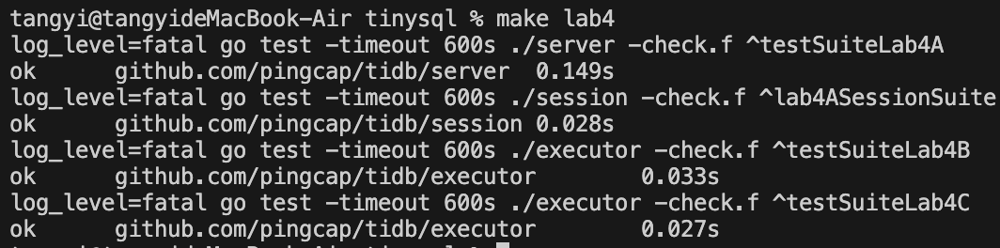
