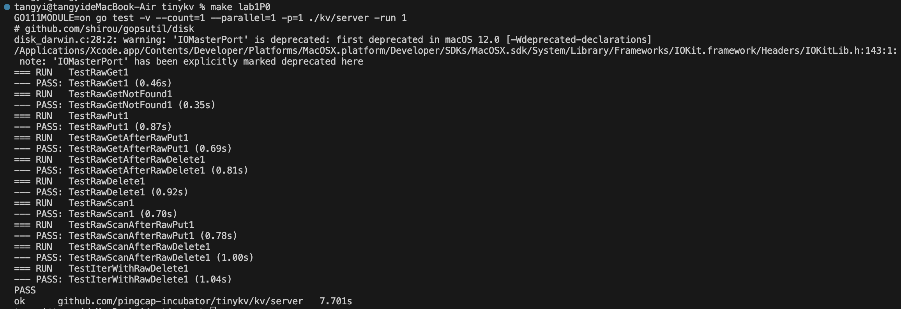
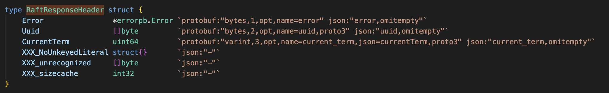

# 10235501451 唐屹 第二次项目实验报告

## lab1

### lab1P0

P0 阶段要求补全 `kv/storage/standalone_storage/standalone_storage.go` 文件中标记为 `// YOUR CODE HERE (lab1)` 的两个核心方法：

1. **`Reader` 方法** ：创建并返回一个只读的存储读取器，支持从 badger 中读取数据；
2. **`Write` 方法** ：接收批量的写操作（包含 Put/Delete 类型），将这些操作原子性地写入 badger 数据库。

在开始写代码之前，我们要明确代码的编写不能脱离于框架的代码规范，因此我们要找到定义规则的相关联文件，我从下列内容中找寻到如何解决问题的方法:

`Write` 方法中的注释 `Try to check the definition of storage.Modify and txn interface of badger`,`StandAloneStorage` 结构体的注释表明它实现了 `storage.Storage` 接口，因此需要找到该接口的定义文件，同时代码中引入了 `github.com/pingcap-incubator/tinykv/kv/util/engine_util` 等的包，因此需要查看相关的文件。

基于上述思路，我重点查看了以下三个核心关联文件，这些文件构成了 P0 阶段的代码规范约束：

1. `kv/storage/storage.go`：定义了 `Storage` 和 `StorageReader` 接口

```go
// Storage 接口：规定了存储引擎的核心功能
type Storage interface {
	Start(client scheduler_client.Client) error
	Stop() error
	Write(ctx *kvrpcpb.Context, batch []Modify) error // 批量写入方法
	Reader(ctx *kvrpcpb.Context) (StorageReader, error) // 读取器创建方法
	Client() scheduler_client.Client
}

// StorageReader 接口：规定了读取器的核心功能
type StorageReader interface {
	// 关键约束：key不存在时返回nil，而非报错
	GetCF(cf string, key []byte) ([]byte, error)
	IterCF(cf string) engine_util.DBIterator
	Close()
}

```

2. `kv/storage/modify.go`：定义封装了所有写操作的核心数据结构（`Modify`/`Put`/`Delete`）

   ```go
   // Modify：封装单个写操作（Put/Delete）
   type Modify struct {
   	Data interface{}
   }

   // Put：写入操作（包含列族、key、value）
   type Put struct {
   	Key   []byte
   	Value []byte
   	Cf    string
   }

   // Delete：删除操作（包含列族、key）
   type Delete struct {
   	Key []byte
   	Cf  string
   }

   // 便捷方法：避免重复的类型断言，具体实现逻辑省去
   func (m *Modify) Key() []byte { /* 实现逻辑 */ }
   func (m *Modify) Value() []byte { /* 实现逻辑 */ }
   func (m *Modify) Cf() string { /* 实现逻辑 */ }
   ```

3. `kv/util/engine_util/util.go`：封装了 badger 列族模拟的工具函数（如 `KeyWithCF`），是实现列族功能的核心依赖。

```go
// 核心函数：将列族名与key拼接，生成编码后的key（模拟列族）
func KeyWithCF(cf string, key []byte) []byte {
	return append([]byte(cf+"_"), key...)
}

// 辅助函数：从事务中读取指定列族的key（BadgerReader已使用）
func GetCFFromTxn(txn *badger.Txn, cf string, key []byte) (val []byte, err error) { /* 实现逻辑 */ }
```

`Reader` 方法实现

根据 `storage.go` 的接口要求，`Reader` 方法需要返回一个只读的 `StorageReader`，而 badger 的所有读操作必须在事务中进行，因此核心思路是：

1. 开启 badger 的只读事务（`NewTransaction(false)`）；
2. 利用已有代码的 `NewBadgerReader` 函数创建读取器实例；
3. 返回读取器和空错误。

```go
func (s *StandAloneStorage) Reader(ctx *kvrpcpb.Context) (storage.StorageReader, error) {
	// 1. 开启badger的只读事务（false表示只读）
	txn := s.db.NewTransaction(false)
	// 2. 创建BadgerReader实例
	reader := NewBadgerReader(txn)
	// 3. 返回读取器和空错误
	return reader, nil
}
```

`Write` 方法实现

根据 `storage.go` 的原子性要求、`modify.go` 的数据结构、`engine_util` 的列族规则，核心思路是：

1. 开启 badger 的读写事务（`NewTransaction(true)`），保证批量操作的原子性；
2. 延迟调用 `txn.Discard()`，避免事务资源泄漏（提交失败时自动回滚）；
3. 遍历批量操作，利用 `Modify` 的便捷方法获取列族和 key，通过 `KeyWithCF` 编码 key；
4. 区分 Put/Delete 类型，调用 `txn.Set`/`txn.Delete` 执行操作；
5. 提交事务，将修改持久化到磁盘。

```
func (s *StandAloneStorage) Write(ctx *kvrpcpb.Context, batch []storage.Modify) error {
	// 1. 开启badger的读写事务（true表示读写，保证批量修改的原子性）
	txn := s.db.NewTransaction(true)
	// 延迟关闭事务：如果提交失败，自动回滚并释放资源
	defer txn.Discard()

	// 2. 遍历所有Modify操作，逐个处理
	for _, m := range batch {
		// 获取列族名和key（利用Modify的便捷方法，避免重复的类型断言）
		cf := m.Cf()
		key := m.Key()
		// 用KeyWithCF编码key（遵循列族模拟规则）
		encodedKey := engine_util.KeyWithCF(cf, key)

		switch data := m.Data.(type) {
		// 3. 处理Put操作：写入键值对
		case storage.Put:
			value := data.Value
			// 调用txn.Set写入编码后的key和value
			if err := txn.Set(encodedKey, value); err != nil {
				return err
			}
		// 4. 处理Delete操作：删除键值对
		case storage.Delete:
			// 调用txn.Delete删除编码后的key
			if err := txn.Delete(encodedKey); err != nil {
				return err
			}
		}
	}

	// 5. 提交事务：将所有修改批量写入磁盘
	if err := txn.Commit(); err != nil {
		return err
	}

	// 6. 所有操作成功，返回nil
	return nil
}
```

测试截图



### lab1P1a


首先 `make labP1a`，根据输出了解需要完成的代码，从报错日志能明确看到，panic 发生在：

```bash
github.com/pingcap-incubator/tinykv/kv/raftstore.(*peer).HandleRaftReady(...)
/Users/tangyi/Desktop/study/db/project2/vldb-2021-labs-master/tinykv/kv/raftstore/peer.go:370 +0x130
```

这说明：`kv/raftstore/peer.go`文件中的 `HandleRaftReady`方法还是空的,继续执行测试后，又出现了多个同类 panic 错误，分别指向：`kv/raftstore/peer_storage.go`中的 `Append`方法：日志追加逻辑未实现；`kv/raftstore/peer_storage.go`中的 `SaveReadyState`方法：Raft 状态持久化逻辑未实现；`kv/raftstore/peer_msg_handler.go`中的 `proposeRaftCommand`方法：客户端请求提议逻辑未实现。这些 panic 错误明确了本次实验需要完成的四个核心方法，我将按照顺序 `Append` → `SaveReadyState` → `proposeRaftCommand` → `HandleRaftReady`逐步实现。

`Append`实现

`Append`方法是 Raft 日志持久化的基础，其核心作用是将 Raft 日志条目写入 Raft 引擎的批量写入器（`engine_util.WriteBatch`），并清理与新日志冲突的旧日志。

```go
func (ps *PeerStorage) Append(entries []eraftpb.Entry, raftWB *engine_util.WriteBatch) error {
	log.Debug(fmt.Sprintf("%s append %d entries", ps.Tag, len(entries)))
	prevLastIndex := ps.raftState.LastIndex
	if len(entries) == 0 {
		return nil
	}
	lastEntry := entries[len(entries)-1]
	lastIndex := lastEntry.Index
	lastTerm := lastEntry.Term
	panic("not implemented yet")
	// YOUR CODE HERE (lab1).
	for _, entry := range entries {
		// Hint1: in the raft write batch, the log key could be generated by `meta.RaftLogKey`.
		//       Also the `LastIndex` and `LastTerm` raft states should be updated after the `Append`.
		//       Use the input `raftWB` to save the append results, do check if the input `entries` are empty.
		//       Note the raft logs are stored as the `meta` type key-value pairs, so the `RaftLogKey` and `SetMeta`
		//       functions could be useful.
		log.Debug(fmt.Sprintf("entry=%v", entry))
	}

	for i := lastIndex + 1; i <= prevLastIndex; i++ {
		// Hint2: As the to be append logs may conflict with the old ones, try to delete the left
		//       old ones whose entry indexes are greater than the last to be append entry.
		//       Delete these previously appended log entries which will never be committed.
	}

	ps.raftState.LastIndex = lastIndex
	ps.raftState.LastTerm = lastTerm
	return nil
}
```

代码中的两个 Hint 明确了实现逻辑的关键步骤，需要逐一实现：

Hint1 （日志写入）：

1. 日志 Key 需通过 `meta.RaftLogKey(regionId, entry.Index)`生成（保证不同 region、不同索引的日志唯一性）；
2. Raft 日志以 `meta`类型的键值对存储，需使用 `SetMeta`函数将日志条目写入 `raftWB`；
3. 需先检查 `entries`是否为空（原代码已实现该检查）；
4. 日志追加后需更新 `raftState`的 `LastIndex`和 `LastTerm`（原代码已保留该逻辑）。

Hint2 （旧日志删除）：

1. 新日志可能与旧日志冲突，需删除索引大于 `lastIndex`的旧日志（即索引从 `lastIndex+1`到 `prevLastIndex`的日志）；
2. 这些旧日志不会再被提交，需通过 `DeleteMeta`函数从 `raftWB`中删除。

根据 hint，我们完成 `Append`功能的实现

```go
// Append 将Raft日志条目追加到存储，处理旧日志冲突并更新Raft状态
func (ps *PeerStorage) Append(entries []eraftpb.Entry, raftWB *engine_util.WriteBatch) error {
	log.Debug(fmt.Sprintf("%s append %d entries", ps.Tag, len(entries)))
	prevLastIndex := ps.raftState.LastIndex
	// 空条目直接返回（对应Hint1：检查entries是否为空）
	if len(entries) == 0 {
		return nil
	}

	lastEntry := entries[len(entries)-1]
	lastIndex := lastEntry.Index
	lastTerm := lastEntry.Term

	// 写入新日志条目（对应Hint1：生成唯一Key并以meta类型写入）
	for _, entry := range entries {
		logKey := meta.RaftLogKey(ps.region.Id, entry.Index)
		if err := raftWB.SetMeta(logKey, &entry); err != nil {
			return err
		}
		log.Debug(fmt.Sprintf("entry=%v", entry))
	}

	// 清理冲突旧日志（对应Hint2：删除索引大于lastIndex的旧日志）
	for i := lastIndex + 1; i <= prevLastIndex; i++ {
		oldLogKey := meta.RaftLogKey(ps.region.Id, i)
		raftWB.DeleteMeta(oldLogKey)
	}

	// 更新Raft最新日志状态（对应Hint1：更新LastIndex和LastTerm）
	ps.raftState.LastIndex = lastIndex
	ps.raftState.LastTerm = lastTerm
	return nil
}
```

`SaveReadyState`实现

`SaveReadyState`是处理 Raft 引擎输出的 `Ready`对象的核心方法，负责将 Raft 的快照（Snapshot）、日志条目（Entries）、硬状态（HardState）等数据持久化到存储引擎中

```go
func (ps *PeerStorage) SaveReadyState(ready *raft.Ready) (*ApplySnapResult, error) {
	kvWB, raftWB := new(engine_util.WriteBatch), new(engine_util.WriteBatch)
	prevRaftState := ps.raftState
	var applyRes *ApplySnapResult = nil
	var err error
	if !raft.IsEmptySnap(&ready.Snapshot) {
		applyRes, err = ps.ApplySnapshot(&ready.Snapshot, kvWB, raftWB)
		if err != nil {
			return nil, err
		}
	}
	panic("not implemented yet")
	// YOUR CODE HERE (lab1).
	// Hint: the outputs of the raft ready are: snapshot, entries, states, try to process
	//       them correctly. Note the snapshot apply may need the kv engine while others will
	//       always use the raft engine.
	if len(ready.Entries) != 0 {
		// Hint1: Process entries if it's not empty.
	}

	// Last index is 0 means the peer is created from raft message
	// and has not applied snapshot yet, so skip persistent hard state.
	if ps.raftState.LastIndex > 0 {
		// Hint2: Handle the hard state if it is NOT empty.
	}

	if !proto.Equal(&prevRaftState, &ps.raftState) {
		raftWB.SetMeta(meta.RaftStateKey(ps.region.GetId()), &ps.raftState)
	}

	kvWB.MustWriteToDB(ps.Engines.Kv)
	raftWB.MustWriteToDB(ps.Engines.Raft)
	return applyRes, nil
}

```

代码中的 `Hint`明确了该方法需要处理的三类数据及关键注意事项:

- 核心 Hint ：`Ready`对象的输出包含 snapshot（快照） 、 entries（日志条目） 、 states（硬状态） ，需正确处理；其中快照需要使用 KV 引擎，日志条目和硬状态仅使用 Raft 引擎。
- Hint1 ：若 `entries`非空，需处理这些日志条目（即持久化到 Raft 引擎）。
- Hint2 ：若硬状态（HardState）非空，需处理该硬状态（即更新到 Raft 状态中并持久化）。

对于 hint1，我们新增以下代码,实现逻辑为:判断 `ready.Entries`是否非空，若非空则调用之前实现的 `Append`方法，将日志条目写入 `raftWB`（Raft 引擎的批量写入器）

```go
if len(ready.Entries) != 0 {
	if err := ps.Append(ready.Entries, raftWB); err != nil {
		return nil, err
	}
}
```

下面是 hint2 的实现逻辑和具体实现的代码:首先判断 `ps.raftState.LastIndex > 0`（避免节点未初始化、未应用快照的情况，原代码注释已提示该注意事项），再判断 `ready.HardState`是否非空，若满足则将 `ready.HardState`赋值给 `ps.raftState.HardState`，更新 Raft 的硬状态

```go
if ps.raftState.LastIndex > 0 && !raft.IsEmptyHardState(ready.HardState) {
	ps.raftState.HardState = &ready.HardState
}
```

这是修改后的完整 `SaveReadyState`

```go
func (ps *PeerStorage) SaveReadyState(ready *raft.Ready) (*ApplySnapResult, error) {
	kvWB, raftWB := new(engine_util.WriteBatch), new(engine_util.WriteBatch)
	prevRaftState := ps.raftState
	var applyRes *ApplySnapResult = nil
	var err error
	if !raft.IsEmptySnap(&ready.Snapshot) {
		applyRes, err = ps.ApplySnapshot(&ready.Snapshot, kvWB, raftWB)
		if err != nil {
			return nil, err
		}
	}

	// Hint1: 处理非空的entries，调用Append方法
	if len(ready.Entries) != 0 {
		if err := ps.Append(ready.Entries, raftWB); err != nil {
			return nil, err
		}
	}

	// Hint2: 处理非空的HardState（LastIndex>0时）
	if ps.raftState.LastIndex > 0 && !raft.IsEmptyHardState(ready.HardState) {
		// 更新raftState的HardState
		ps.raftState.HardState = &ready.HardState
	}

	if !proto.Equal(&prevRaftState, &ps.raftState) {
		raftWB.SetMeta(meta.RaftStateKey(ps.region.GetId()), &ps.raftState)
	}

	kvWB.MustWriteToDB(ps.Engines.Kv)
	raftWB.MustWriteToDB(ps.Engines.Raft)
	return applyRes, nil
}
```

`proposeRaftCommand` 实现

`proposeRaftCommand`是处理客户端 Raft 命令请求的核心方法，负责将合法的请求提议到 Raft 集群中，是客户端请求进入 Raft 流程的入口。

```go
func (d *peerMsgHandler) proposeRaftCommand(msg *raft_cmdpb.RaftCmdRequest, cb \*message.Callback) {
panic("not implemented yet")
// YOUR CODE HERE (lab1).
// Hint1: do `preProposeRaftCommand` check for the command, if the check fails, need to execute the
// callback function and return the error results. `ErrResp` is useful to generate error response.

    // Hint2: Check if peer is stopped already, if so notify the callback that the region is removed, check
    // the`destroy` function for related utilities. `NotifyReqRegionRemoved` is useful to generate error response.

    // Hint3: Bind the possible response with term then do the real requests propose using the`Propose` function.
    // Note:
    // The peer that is being checked is a leader. It might step down to be a follower later. It
    // doesn't matter whether the peer is a leader or not. If it's not a leader, the proposing
    // command log entry can't be committed. There are some useful information in the `ctx` of the `peerMsgHandler`.

}

func (p *peer) HandleRaftReady(msgs []message.Msg, pdScheduler chan<- worker.Task, trans Transport) (*ApplySnapResult, []message.Msg) {
if p.stopped {
return nil, msgs
}

    if p.HasPendingSnapshot() && !p.ReadyToHandlePendingSnap() {
    	log.Debug(fmt.Sprintf("%v [apply_id: %v, last_applying_idx: %v] is not ready to apply snapshot.", p.Tag, p.peerStorage.AppliedIndex(), p.LastApplyingIdx))
    	return nil, msgs
    }

    // YOUR CODE HERE (lab1). There are some missing code pars marked with`Hint` above, try to finish them.
    // Hint1: check if there's ready to be processed, if no return directly.
    panic("not implemented yet")

    // Start to handle the raft ready.
    log.Debug(fmt.Sprintf("%v handle raft ready", p.Tag))

    ready := p.RaftGroup.Ready()
    // TODO: workaround for:
    //   in kvproto/eraftpb, we use *SnapshotMetadata
    //   but in etcd, they use SnapshotMetadata
    if ready.Snapshot.GetMetadata() == nil {
    	ready.Snapshot.Metadata = &eraftpb.SnapshotMetadata{}
    }

    // The leader can write to disk and replicate to the followers concurrently
    // For more details, check raft thesis 10.2.1.
    if p.IsLeader() {
    	p.Send(trans, ready.Messages)
    	ready.Messages = ready.Messages[:0]
    }
    ss := ready.SoftState
    if ss != nil && ss.RaftState == raft.StateLeader {
    	p.HeartbeatScheduler(pdScheduler)
    }

    applySnapResult, err := p.peerStorage.SaveReadyState(&ready)
    if err != nil {
    	panic(fmt.Sprintf("failed to handle raft ready, error: %v", err))
    }
    if !p.IsLeader() {
    	p.Send(trans, ready.Messages)
    }

    if applySnapResult != nil {
    	/// Register self to applyMsgs so that the peer is then usable.
    	msgs = append(msgs, message.NewPeerMsg(message.MsgTypeApplyRefresh, p.regionId, &MsgApplyRefresh{
    		id:     p.PeerId(),
    		term:   p.Term(),
    		region: p.Region(),
    	}))

    // Snapshot's metadata has been applied.
    	p.LastApplyingIdx = p.peerStorage.truncatedIndex()
    } else {
    	committedEntries := ready.CommittedEntries
    	ready.CommittedEntries = nil
    	l := len(committedEntries)
    	if l > 0 {
    		p.LastApplyingIdx = committedEntries[l-1].Index
    		msgs = append(msgs, message.Msg{Type: message.MsgTypeApplyCommitted, Data: &MsgApplyCommitted{
    			regionId: p.regionId,
    			term:     p.Term(),
    			entries:  committedEntries,
    		}, RegionID: p.regionId})
    	}
    }

    // YOUR CODE HERE (lab1). There are some missing code pars marked with`Hint` above, try to finish them.
    // Hint2: Try to advance the states in the raft group of this peer after processing the raft ready.
    //        Check about the `Advance` method in for the raft group.
    panic("not implemented yet")

    return applySnapResult, msgs

}
```

根据提示，Hint1 需要完成 ：调用 `preProposeRaftCommand`对请求做前置合法性校验（如 storeID、peerID、任期、区域 epoch 验证等），若校验失败，需调用 `ErrResp`工具函数生成错误响应，执行回调函数并返回错误结果。我编写了以下代码实现，实现逻辑为：调用 `d.preProposeRaftCommand(msg)`执行前置校验，若返回错误则用 `ErrResp(err)`生成错误响应，初始化响应的 `Header`后设置任期字段，最后调用 `cb.Done(resp)`将错误响应返回给客户端并终止方法。

```go
// Hint1: 执行前置检查（storeID、peerID、term、epoch等）
err := d.preProposeRaftCommand(msg)
if err != nil {
	// 检查失败，生成错误响应并调用回调
	resp := ErrResp(err)
	// 初始化Header并尝试设置任期
	if resp.Header == nil {
		resp.Header = &raft_cmdpb.RaftResponseHeader{}
	}
	resp.Header.Term = d.Term()
	cb.Done(resp)
	return
}
```

Hint2 需要完成 ：检查当前 peer 是否已停止（销毁），若已停止，需调用 `NotifyReqRegionRemoved`工具函数生成 “区域已移除” 的错误响应，并通知回调函数，避免对已停止的 peer 执行无效操作。下面代码的逻辑为：通过 `d.stopped`标识判断 peer 是否已停止，若停止则调用 `NotifyReqRegionRemoved`并传入区域 ID 和回调函数，之后直接返回终止方法执行。

```go
// Hint2: 检查peer是否已停止，若是则通知回调（区域已移除）
if d.stopped {
	NotifyReqRegionRemoved(d.regionId, cb)
	return
}
```

Hint3 需要完成 ：将响应与当前节点的 Raft 任期绑定，再调用 `Propose`函数将请求提议到 Raft 集群；若提议失败，需执行回调函数返回错误，且无需处理节点后续的 Leader 状态变化（`ctx`中包含提议所需的核心信息）。下面代码初始化错误响应 `errResp`，在其 `Header`中设置任期字段，调用 `d.peer.Propose`方法执行请求提议，若提议失败则调用 `cb.Done(errResp)`返回响应。

```go
// Hint3: 绑定任期，调用Propose方法提议请求
errResp := &raft_cmdpb.RaftCmdResponse{
	Header: &raft_cmdpb.RaftResponseHeader{
		Term: d.Term(),
	},
}
// 调用peer的Propose方法提议请求
success := d.peer.Propose(d.ctx.engine.Kv, d.ctx.cfg, cb, msg, errResp)
if !success {
	// 提议失败，调用回调返回错误
	cb.Done(errResp)
}
```

以下是完整的 `preProposeRaftCommand `代码

```go
func (d *peerMsgHandler) proposeRaftCommand(msg *raft_cmdpb.RaftCmdRequest, cb *message.Callback) {
	// Hint2: 检查peer是否已停止，若是则通知回调（区域已移除）
	if d.stopped {
		NotifyReqRegionRemoved(d.regionId, cb)
		return
	}

	// Hint1: 执行前置检查（storeID、peerID、term、epoch等）
	err := d.preProposeRaftCommand(msg)
	if err != nil {
		// 检查失败，生成错误响应并调用回调
		resp := ErrResp(err)
		// 初始化Header并设置任期
		if resp.Header == nil {
			resp.Header = &raft_cmdpb.RaftResponseHeader{}
		}
		// 设置当前Raft节点的任期
		resp.Header.Term = d.Term()
		cb.Done(resp)
		return
	}

	// Hint3: 绑定任期，调用Propose方法提议请求
	errResp := &raft_cmdpb.RaftCmdResponse{
		// 初始化Header并设置当前任期
		Header: &raft_cmdpb.RaftResponseHeader{
			Term: d.Term(),
		},
	}
	// 调用peer的Propose方法提议请求
	success := d.peer.Propose(d.ctx.engine.Kv, d.ctx.cfg, cb, msg, errResp)
	if !success {
		// 提议失败，调用回调返回错误
		cb.Done(errResp)
	}
}
```

`HandleRaftReady`实现

`HandleRaftReady`是处理 Raft 集群 `Ready`对象的顶层方法，负责协调 Raft 状态检查、Ready 处理与 RaftGroup 状态推进，是连接 Raft 核心引擎与存储层的关键顶层逻辑。

```go
func (p *peer) HandleRaftReady(msgs []message.Msg, pdScheduler chan<- worker.Task, trans Transport) (*ApplySnapResult, []message.Msg) {
	if p.stopped {
		return nil, msgs
	}

	if p.HasPendingSnapshot() && !p.ReadyToHandlePendingSnap() {
		log.Debug(fmt.Sprintf("%v [apply_id: %v, last_applying_idx: %v] is not ready to apply snapshot.", p.Tag, p.peerStorage.AppliedIndex(), p.LastApplyingIdx))
		return nil, msgs
	}

	// YOUR CODE HERE (lab1). There are some missing code pars marked with `Hint` above, try to finish them.
	// Hint1: check if there's ready to be processed, if no return directly.
	panic("not implemented yet")

	// Start to handle the raft ready.
	log.Debug(fmt.Sprintf("%v handle raft ready", p.Tag))

	ready := p.RaftGroup.Ready()
	// TODO: workaround for:
	//   in kvproto/eraftpb, we use *SnapshotMetadata
	//   but in etcd, they use SnapshotMetadata
	if ready.Snapshot.GetMetadata() == nil {
		ready.Snapshot.Metadata = &eraftpb.SnapshotMetadata{}
	}

	// The leader can write to disk and replicate to the followers concurrently
	// For more details, check raft thesis 10.2.1.
	if p.IsLeader() {
		p.Send(trans, ready.Messages)
		ready.Messages = ready.Messages[:0]
	}
	ss := ready.SoftState
	if ss != nil && ss.RaftState == raft.StateLeader {
		p.HeartbeatScheduler(pdScheduler)
	}

	applySnapResult, err := p.peerStorage.SaveReadyState(&ready)
	if err != nil {
		panic(fmt.Sprintf("failed to handle raft ready, error: %v", err))
	}
	if !p.IsLeader() {
		p.Send(trans, ready.Messages)
	}

	if applySnapResult != nil {
		/// Register self to applyMsgs so that the peer is then usable.
		msgs = append(msgs, message.NewPeerMsg(message.MsgTypeApplyRefresh, p.regionId, &MsgApplyRefresh{
			id:     p.PeerId(),
			term:   p.Term(),
			region: p.Region(),
		}))

		// Snapshot's metadata has been applied.
		p.LastApplyingIdx = p.peerStorage.truncatedIndex()
	} else {
		committedEntries := ready.CommittedEntries
		ready.CommittedEntries = nil
		l := len(committedEntries)
		if l > 0 {
			p.LastApplyingIdx = committedEntries[l-1].Index
			msgs = append(msgs, message.Msg{Type: message.MsgTypeApplyCommitted, Data: &MsgApplyCommitted{
				regionId: p.regionId,
				term:     p.Term(),
				entries:  committedEntries,
			}, RegionID: p.regionId})
		}
	}

	// YOUR CODE HERE (lab1). There are some missing code pars marked with `Hint` above, try to finish them.
	// Hint2: Try to advance the states in the raft group of this peer after processing the raft ready.
	//        Check about the `Advance` method in for the raft group.
	panic("not implemented yet")

	return applySnapResult, msgs
}

```

根据提示，Hint1 需要完成 ：检查当前 RaftGroup 是否有 Ready 对象需要处理，若没有则直接返回，避免执行后续无效的 Ready 处理逻辑。我写了以下代码实现该逻辑 ，实现逻辑为：调用 `p.RaftGroup.HasReady()`方法判断是否存在待处理的 Ready，若返回 `false`则直接返回 `nil`和原始消息列表，终止方法执行；同时移除了 Hint1 位置的 `panic`语句。

```go
// Hint1: check if there's ready to be processed, if no return directly.
if !p.RaftGroup.HasReady() {
    return nil, msgs
}
```

Hint2 ：在处理完 Raft Ready 对象后，调用 RaftGroup 的 `Advance`方法推进其内部状态（这是 Raft 算法的关键步骤，若不执行，RaftGroup 会一直保留已处理的 Ready，导致后续流程阻塞）。

下列代码实现逻辑为：在 Ready 处理完成（包括持久化、消息发送、条目应用）后，调用 `p.RaftGroup.Advance(ready)`方法，将已处理的 Ready 传入以更新 RaftGroup 的状态；同时移除了 Hint2 位置的 `panic`语句。

```go
// Hint2: Try to advance the states in the raft group of this peer after processing the raft ready.
p.RaftGroup.Advance(ready)
```

以下是完整的 `HandleRaftReady` 代码

```go
func (p *peer) HandleRaftReady(msgs []message.Msg, pdScheduler chan<- worker.Task, trans Transport) (*ApplySnapResult, []message.Msg) {
	if p.stopped {
		return nil, msgs
	}

	if p.HasPendingSnapshot() && !p.ReadyToHandlePendingSnap() {
		log.Debug(fmt.Sprintf("%v [apply_id: %v, last_applying_idx: %v] is not ready to apply snapshot.", p.Tag, p.peerStorage.AppliedIndex(), p.LastApplyingIdx))
		return nil, msgs
	}

	// YOUR CODE HERE (lab1). There are some missing code pars marked with `Hint` above, try to finish them.
	// Hint1: check if there's ready to be processed, if no return directly.
	// 实现Hint1：检查是否有Ready需要处理，无则直接返回
	if !p.RaftGroup.HasReady() {
		return nil, msgs
	}

	// Start to handle the raft ready.
	log.Debug(fmt.Sprintf("%v handle raft ready", p.Tag))

	ready := p.RaftGroup.Ready()
	// TODO: workaround for:
	//   in kvproto/eraftpb, we use *SnapshotMetadata
	//   but in etcd, they use SnapshotMetadata
	if ready.Snapshot.GetMetadata() == nil {
		ready.Snapshot.Metadata = &eraftpb.SnapshotMetadata{}
	}

	// The leader can write to disk and replicate to the followers concurrently
	// For more details, check raft thesis 10.2.1.
	if p.IsLeader() {
		p.Send(trans, ready.Messages)
		ready.Messages = ready.Messages[:0]
	}
	ss := ready.SoftState
	if ss != nil && ss.RaftState == raft.StateLeader {
		p.HeartbeatScheduler(pdScheduler)
	}

	applySnapResult, err := p.peerStorage.SaveReadyState(&ready)
	if err != nil {
		panic(fmt.Sprintf("failed to handle raft ready, error: %v", err))
	}
	if !p.IsLeader() {
		p.Send(trans, ready.Messages)
	}

	if applySnapResult != nil {
		/// Register self to applyMsgs so that the peer is then usable.
		msgs = append(msgs, message.NewPeerMsg(message.MsgTypeApplyRefresh, p.regionId, &MsgApplyRefresh{
			id:     p.PeerId(),
			term:   p.Term(),
			region: p.Region(),
		}))

		// Snapshot's metadata has been applied.
		p.LastApplyingIdx = p.peerStorage.truncatedIndex()
	} else {
		committedEntries := ready.CommittedEntries
		ready.CommittedEntries = nil
		l := len(committedEntries)
		if l > 0 {
			p.LastApplyingIdx = committedEntries[l-1].Index
			msgs = append(msgs, message.Msg{Type: message.MsgTypeApplyCommitted, Data: &MsgApplyCommitted{
				regionId: p.regionId,
				term:     p.Term(),
				entries:  committedEntries,
			}, RegionID: p.regionId})
		}
	}

	// YOUR CODE HERE (lab1). There are some missing code pars marked with `Hint` above, try to finish them.
	// Hint2: Try to advance the states in the raft group of this peer after processing the raft ready.
	//        Check about the `Advance` method in for the raft group.
	// 实现Hint2：处理完Ready后推进RaftGroup状态
	p.RaftGroup.Advance(ready)

	return applySnapResult, msgs
}
```

第一次 makeP1a 之后，我发现出现了报错，`raft_cmdpb.RaftResponseHeader`结构体中 不存在 `Term`字段 ，导致代码无法通过编译。


为了确认正确的字段名，我查看了 `raft_cmdpb.RaftResponseHeader`的 protobuf 生成代码，其定义如下：



从定义中可以明确看到，任期对应的字段名是 **`CurrentTerm`**，而非 `Term`。在确认正确字段名后，我对 `proposeRaftCommand`方法中所有使用 `Term`的位置进行替换，这是修改后完整代码:

```go
func (d *peerMsgHandler) proposeRaftCommand(msg *raft_cmdpb.RaftCmdRequest, cb *message.Callback) {
	// Hint2: 检查peer是否已停止，若是则通知回调（区域已移除）
	if d.stopped {
		NotifyReqRegionRemoved(d.regionId, cb)
		return
	}

	// Hint1: 执行前置检查（storeID、peerID、term、epoch等）
	err := d.preProposeRaftCommand(msg)
	if err != nil {
		// 检查失败，生成错误响应并调用回调
		resp := ErrResp(err)
		// 初始化Header并设置CurrentTerm（替换原来的Term）
		if resp.Header == nil {
			resp.Header = &raft_cmdpb.RaftResponseHeader{}
		}
		resp.Header.CurrentTerm = d.Term()
		cb.Done(resp)
		return
	}

	// Hint3: 绑定CurrentTerm，调用Propose方法提议请求
	errResp := &raft_cmdpb.RaftCmdResponse{
		// 初始化Header并设置CurrentTerm
		Header: &raft_cmdpb.RaftResponseHeader{
			CurrentTerm: d.Term(),
		},
	}
	// 调用peer的Propose方法提议请求
	success := d.peer.Propose(d.ctx.engine.Kv, d.ctx.cfg, cb, msg, errResp)
	if !success {
		// 提议失败，调用回调返回错误
		cb.Done(errResp)
	}
}
```

下面是运行通过的截图


